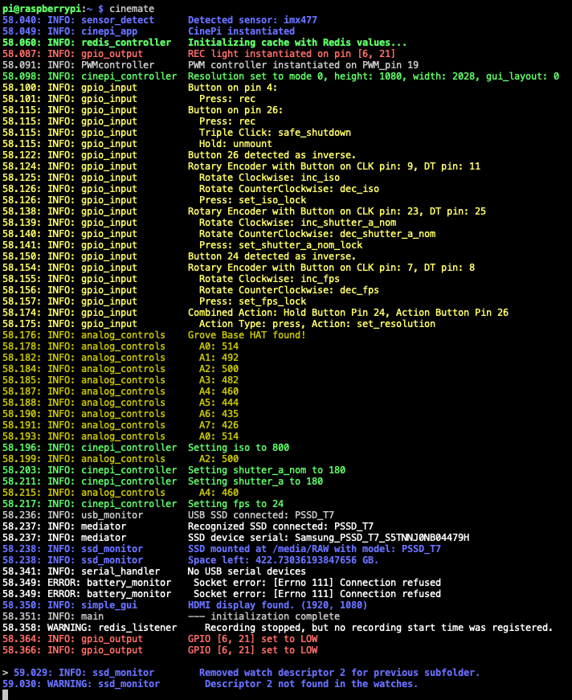

```cinemate development branch```

# CineMate – manual controls for cinepi-raw
CineMate scripts is a way for users to implement and customize manual controls for their [cinepi-raw](https://github.com/cinepi/cinepi-raw) build. 

Project aims at offering an easy way to build a custom camera. 

For basic operation and experimentation, only Raspberry Pi, camera board and monitor is needed. For practical use, buttons and switches can easily be added, allowing for a custom build.

A ready made disk image, with a Bullseye installation + cinepi-raw and CineMate scripts can be found in the release section of this repo.

Join the CinePi Discord [here](https://discord.gg/Hr4dfhuK).

## Functions
- Recording and various camera controls with **GPIO**, **USB keyboard** and **USB/GPIO serial**
- Support for **rotary encoders** 
- **Simple GUI** on the HDMI display
- **CineMate CLI** via SSH.
- System button for **safe shutdown** of the Pi, start-up and unmounting of SSD drive.
- Support for **Grove Base HAT** for iso, shutter angle and fps controls via potentiometers.
- Support for **PiSugar** (displays battery status in Simple GUI)
- Easy user customization of GPIO and camera controls using a settings file.
- Experimental **PWM mode**, for hardware control of frame rate and shutter speed, allowing for **in-camera speed ramping**

## Hardware requirements
- Rasberry Pi 4B
- Official HQ or GS camera
- HDMI monitor

For recording, use a high speed SSD (min 200 MB/s write speed). Samsung T5, T7 and Extreme have been confirmed to work.

## Installing 

Download the disk image from here: https://github.com/Tiramisioux/cinemate/releases/tag/dev

Burn to SD card (> 8 GB) using Raspberry Pi imager or Balena Etcher. 

| :exclamation:  When connecting the camera module to the Pi, make sure it is the Pi is not powered. It is not advised to hot-swap the camera cable.   |
|-----------------------------------------|

## Basic build

Insert the SD card into the Pi. Connect camera, HDMI monitor and SSD drive.

Connect simple push buttons to the Pi for basic camera operation. 

To just try out the camera functions, you can also short the GPIOs using a paper clip.


|Camera function                 |GPIO push button |
|--------------------------------|-----------------|
|start/stop recording            |4, 5             |
|increase iso one step           |27               |
|decrease iso one step           |15               |
|change resolution               |26 (single click)|
|reboot                          |26 (double click)|
|safe shutdown                   |26 (triple click)|
|unmount SSD                     |26 (hold for 3 seconds)|

Rec light LED can be connected to pins 6 or 21. 


| :exclamation:  When connecting an LED to the GPIOs, be sure to use a resistor   |
|-----------------------------------------|


|:point_up:  Connect GPIO 26 to GPIO 03 using a jumper wire, and the system button attached to GPIO 26 will also wake up the Pi, after being shutdown.   |
|-----------------------------------------|

## Adding rotary encoders

For controlling iso, shutter angle and frame rate rotary encoders can be used. To engage parameter lock, click the rotary encoder push button.

|                                 |clk |dt  |encoder button|
|---------------------------------|----|----|--------------|
|set iso                          |9   |11  |10            |
|set shutter angle                |23  |25  |13            |
|set fps                          |7   |8   |20            |

The button also allows for combined actions together with the system button (GPIO 26).

## Simple GUI

to be added

## Connecting via SSH

For SSH:ing to the Pi, use the following credentials:

    User: pi
    Password: 1

## CineMate CLI

Cinemate offers a set of Command-Line Interface (CLI) commands that allow users to control camera settings directly from the terminal.

#### Disabling CineMate autostart

To stop the autostarted instance:

    cd cinemate
    make stop

To enable (and start) again:

    cd cinemate
    make start

To disable autostart:

    cd cinemate
    make uninstall

To enable autostart:

    cd cinemate
    make install


#### Running CineMate manually

Anywhere in the cli, type

    cinemate

This will show a startup sequence. Terminal will now accept the commands from the list below.



*Example startup sequence, showing the output from CineMates modules*

For extensive logging and troubleshooting, CineMate can be started using the `cinemate -debug` command.

## Example CLI commands

Start/stop recording:

    > rec

Adjust the ISO setting. Requires an integer argument.

    > set_iso 800

Set the shutter angle. Requires a float argument for the angle.

    > set_shutter_a 172.8

Configure the frames per second. Requires an integer argument.

    > set_fps 24


Lock/unlock iso, shutter angle or fps: Toggle locks or set them directly. Providing an argument directly sets the value. Omitting the argument will toggle the control.

    > set_iso_lock

    > set_shutter_a_nom_lock 1

    > set_fps_lock

Enable or disable doubling the FPS rate. 

    > set_fps_double
    
    > set_fps_double 1

## Command index

This table includes all the available commands (method calls) for the CineMate CLI and the GPIO default settings of `cinemate/src/settings.json`. 

Commands are also possible to send to the Pi via USB serial.

| Camera function           | CineMate CLI/USB serial command | arguments                     | GPIO button         | GPIO rotary encoder       | GPIO switch |Grove Base HAT|USB keyboard|
| ------------------------- | ------------------------------- | ----------------------------- | ------------------- | ------------------------- | ----------- |-----------| -----------|
| start/stop recording      | `rec`                           | None (toggle control)         | 4, 5                   |                           |             |           | `0`           |
| set iso                   | `set_iso`                       | integer                       |                     | clk 9, dt 11, bu 10       |             |A0          |
| iso increase              | `inc_iso`                       | \-                            | 17                  |                           |             |            | `1`           |
| iso decrease              | `dec_iso`                       | \-                            | 14                  |                           |             |            |`2`            |
| set shutter angle         | `set_shutter_a_nom`             | float                         |                     | clk 23, dt 25, bu 13      |             |A2          |
| shu increase 1 deg        | `inc_shutter_a_nom`             | \-                            |                     |                           |             |            |`3`            |
| shu decrease 1 deg        | `dec_shutter_a_nom`             | \-                            |                     |                           |             |            |`4`         |
| set fps                   | `set_fps`                       | integer                       |                     | clk 7, dt 8, bu 20        |             |A4          |
| fps increase 1 fps        | `inc_fps`                       | \-                            |                     |                           |             |            |`5`            |
| fps decrease 1 fps        | `dec_fps`                       | \-                            |                     |                           |             |            |`6`            |
| lock iso                  | `set_iso_lock`                  | 0, 1 or None (toggle control) |                     | 10 (single click)         |             |            |            |
| lock shutter angle        | `set_shutter_a_nom_lock`        | 0, 1 or None (toggle control) |                     | 13 (single click)         |             |            |            |
| lock fps                  | `set_fps_lock`                  | 0, 1 or None (toggle control) |                     | 20 (single click)         |             |            |            |
| lock all controls         | `set_all_lock`                  | 0, 1 or None (toggle control) |                     |                           |             |            |            |
| lock shutter angle + fps  | `set_shutter_a_nom_fps_lock`    | 0, 1 or None (toggle control) |                     |                           | 24          |            |            |
| sync shutter angle to fps | `set_shutter_a_sync`            | 0, 1 or None (toggle control) |                     | hold 13 + single click 26 | 16          |            |            |
| double fps                | `set_fps_double`                | 0, 1 or None (toggle control) | 12                  | hold 20 + single click 26 |             |            |            |
| pwm mode                  | `set_pwm_mode`                  | 0, 1 or None (toggle control) |                     | hold 10 + single click 26 | 22          |            |            |
| change resolution         | `set_resolution`                | 0, 1 or None (toggle control) | 26 (single click)   |                           |             |            |`8`            |
| reboot                    | `reboot`                        | \-                            | 26 (double click)   |                           |             |            |            |
| safe shutdown             | `shutdown`                      | \-                            | 26 (triple click)   |                           |             |            |            |
| unmount drive             | `unmount`                       | \-                            | 26 (hold for 3 sec) |                           |             |            |`9`            |


## Default iso, shutter angle and fps arrays
|Setting|Values                     |
|--------------|---------------------------------------------------|
|iso           |100, 200, 400, 640, 800, 1200, 1600, 2500 and 3200.|
|shutter angle |1-360 in one degree increments + 172.8 and 346.6   |
|fps           |1-50 fps @ 2028x1080, 1-40 fps @ 2028x1520         |

The arrays can be customized using the settings file (see below).

## Customizing camera functions and GPIO settings

The settings file can be found in `cinemate/src/settings.json`. Here the user can define their own buttons, switches, rotary encoders and combined actions, modifying the table above.

### General Settings
Define your hardware setup and desired application behavior:

    {
    "pwm_pin": 19,
    "rec_out_pin": [6, 21],
    "iso_steps": [100, 200, 400, 640, 800, 1200, 1600, 2500, 3200],
    "additional_shutter_a_steps": [172.8, 346.6],
    "fps_steps": null
    }

### Analog Controls
Map Grove Base HAT ADC channels to iso, shutter angle and fps controls:

    "analog_controls": {
    "iso_pot": "A0",
    "shutter_a_pot": "A2",
    "fps_pot": "A4"
    }

### Buttons

Setup buttons with actions for different interactions:

    "buttons": [
    {
        "pin": 5,
        "pull_up": "False",
        "debounce_time": "0.1",
        "press_action": {"method": "rec"}
    }
    ]

Each button can be configured with a variety of actions based on different interactions:

**Press Action:** Triggers a specified method upon a simple press.

**Single, Double, and Triple Click Actions:** Specify methods to execute based on the number of successive clicks.

**Hold Action:** Executes a method when the button is held down for a longer duration.

Each action can specify a method that corresponds to a function within the application, and args, an array of arguments that the method requires.

Note that if you have both a Press Action and a Single-Click action on a pin, the pin will first execute the Press Action and when released, execute the Single-Click Action. Combining Press Action and Click actions on the same pin is therefore not recommended.

### Two-way switches
Two-way switches are configured in the two_way_switches section and have actions for both states:

**State On Action** and **State Off Action**: Define what actions to take when the switch is turned on or off, respectively. Similar to button actions, these can specify a method and args.

    "two_way_switches": [
    {
        "pin": 16,
        "state_on_action": {"method": "set_shutter_a_sync", "args": [false]},
        "state_off_action": {"method": "set_shutter_a_sync", "args": [true]}
      },
    }
    ]

### Rotary Encoders
Configure rotary encoders for settings adjustments and optional button presses:

    "rotary_encoders": [
      {
        "clk_pin": 9,
        "dt_pin": 11,
        "button_pin": 10,
        "pull_up": "False",
        "debounce_time": "0.05",
        "button_actions": {
          "press_action": "None",
          "single_click_action": {"method": "set_iso_lock"},
          "double_click_action": "None",
          "hold_action": "None"
        },
        "encoder_actions": {
          "rotate_clockwise": {"method": "inc_iso", "args": []},
          "rotate_counterclockwise": {"method": "dec_iso", "args": []}
        }
    }
    ]

**Clockwise and Counterclockwise Actions**: Specify methods to execute when the encoder is rotated in either direction.

**Button Actions:** If the encoder has a push button, configure actions similar to standalone buttons, including press, click, and hold interactions.

### Combined Actions
Set up interactions involving multiple inputs:

    "combined_actions": [
    {
      "hold_button_pin": 13,
      "action_button_pin": 26,
      "action_type": "press",
      "action": {"method": "set_shutter_a_sync"}
    }

Combined actions allow for complex interactions involving multiple buttons or switches:

**Hold Button Pin** and **Action Button Pin:** Define the pins of the buttons involved in the combined action.

**Action Type:** Specifies the type of action required from the action_button_pin (e.g., press). 

**Action:** Determines the method to execute when the combined action condition is met.

## Additional hardware

### Grove Base HAT
to be added
### Petroblock

to be added

### Pisugar

## PWM mode (experimental)

## Adding non-Samsung SSD drives

to be added

## Updating the Development Branch

    cd cinemate
    git pull origin development

| :exclamation:  Note that if you update this repo, your setting-file will be overwritten with the latest default CineMate settings file. If you are using a custom settings file, be sure to copy it to somewhere outside of the cinemate folder before updating, or see below for how to exclude the file from git update.   |
|-----------------------------------------|

## Updating CineMate while keeping your custom ```settings.json```

To ensure that you can update the cinemate repository on your Raspberry Pi while retaining your custom settings in ```/src/settings.json```, follow these steps:

1) Navigate to the CineMate directory and stop any autostarted instance of CineMate.

    ```
    cd cinemate
    make stop
    ```

2) Stash Your Custom Settings File

    Before updating, stash your ```settings.json``` file to prevent it from being overwritten during the update:
    
    ```
    git stash push src/settings.json -m "Saving custom settings.json"
    ```

3. Pull the Latest Updates

    Pull the latest updates from the development branch of the cinemate repository:
    
    ```
    git pull origin development
    ```

4. Reapply Your Custom Settings
    
    After pulling the updates, reapply your ```settings.json``` file:

    ```
    git stash pop
    ```

    If you encounter any merge conflicts with ```settings.json```, Git will notify you. Resolve the conflicts by manually merging the changes, and then commit the resolved version of ```settings.json```.

5. Restart CineMate

    ```
    cinemate
    ```


#### Note on future updates

It's a good practice to keep a backup of your ```settings.json``` file outside the repository directory. This ensures that you have a copy of your custom settings in case of unexpected changes or merge conflicts.
