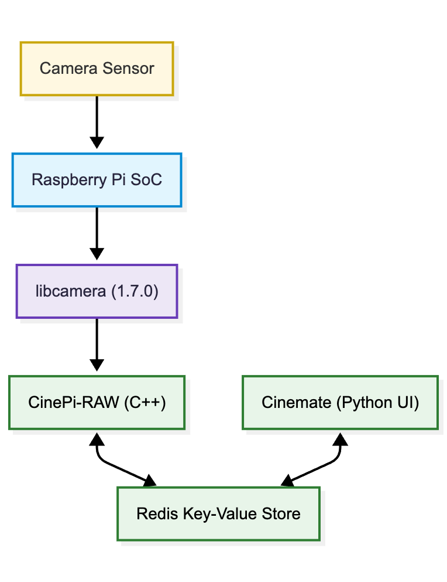

# What is it?
**Cinemate** is a boilerplate cinema camera system for Raspberry Pi 5.  builds upon CinePi-raw, authored by Csaba Nagy for enabling 12 bit (or even 16 bit) Cinema DNG recordings using off-the-shelf components.  

Cinemate provides a minimal starting point that you can extend with your own controls and accessories. 

The project combines a Python UI with a custom fork of [cinepi-raw](https://github.com/Tiramisioux/cinepi-raw/tree/rpicam-apps_1.7_custom_encoder).

## New features in version 3.2

- improved mounting mechanics for NVME and SSD drives with less drop frames
- erase and format drives via Cinemate CLI (ext4/NTFS)
- storage preroll to "warm up" the recording media, improving writing stability
- improved audio sync with correction of effective fps (different resolutions/frame rates due to sensor VBLANK), available for fine tuning in `src/module/sensor_correction_factors.py`
- option to record a fixed number of frames or seconds for user calibration of fps correction factors (run Cinemate manually for this calibration as feedback is supplied in the terminal)
- improved recognition of attached microphones

## Compatible sensors

- IMX477 (official Raspberry Pi HQ camera)
- IMX296 (official Raspberry Pi GS camera)
- IMX283 ([OneInchEye](https://www.tindie.com/products/will123321/oneincheye-v20/) by Will Whang)
- IMX585 ([Starlight Eye](https://www.tindie.com/products/will123321/starlighteye/) by Will Whang)

## Preinstalled hardware

- [CFE Hat](https://www.tindie.com/products/will123321/cfe-hat-for-raspberry-pi-5/)
- [Grove Base Hat](https://wiki.seeedstudio.com/Grove_Base_Hat_for_Raspberry_Pi/)
- [Adafruit I2C Quad Rotary Encoder](https://www.adafruit.com/product/5752)

## Camera stack
 
Apps change settings by updating Redis keys. CinePi-RAW listens for those updates and captures frames accordingly while Cinemate provides the camera user interface.

## Installation
See the [releases section](https://github.com/Tiramisioux/cinemate/releases) for preinstalled image file and Quick Start Guide. 

For manual install, see the [documentation](https://tiramisioux.github.io/cinemate/installation-steps/).

## Bare-bones build
To try Cinemate you need:
- Raspberry Pi 4 or 5
- Official HQ or GS camera module
- SSD drive such as a Samsung T7 formatted `ext4` and labelled `RAW`
- HDMI monitor or a phone/tablet connected to the Pi hotspot for preview

## Customization
Buttons, encoders and oled display are optional and configured via settings file.

## Documentation
Full manual installation instructions, configuration guides and CLI reference live [here](https://tiramisioux.github.io/cinemate/).

Join the [CinePi Discord](https://discord.gg/Hr4dfhuK) for discussions and sharing builds.

## Acknowledgements

The [**Cinemate**](https://github.com/Tiramisioux/cinemate) stack is built on top of several open-source projects. Special thanks to all authors!

- [**CinePi-raw**](https://github.com/cinepi/cinepi-raw) – Csaba Nagy
- [**IMX585 and IMX283 drivers**](https://github.com/will127534) – Will Whang
- [**libcamera**](https://libcamera.org) – Ideas on board
- [**cpp-mjpeg-streamer**](https://github.com/nadjieb/cpp-mjpeg-streamer) – Nadjieb Mohammadi
- [**lgpio**](https://github.com/joan2937/lg) – Joan
- [**PiShrink**](https://github.com/Drewsif/PiShrink) - Drew Bonasera 

Also thanks to Simon at [Altcinecam](https://altcinecam.com) for support and assistance!

Get your sensors and CFE Hats here: https://www.tindie.com/stores/will123321/

## Supporting the project

