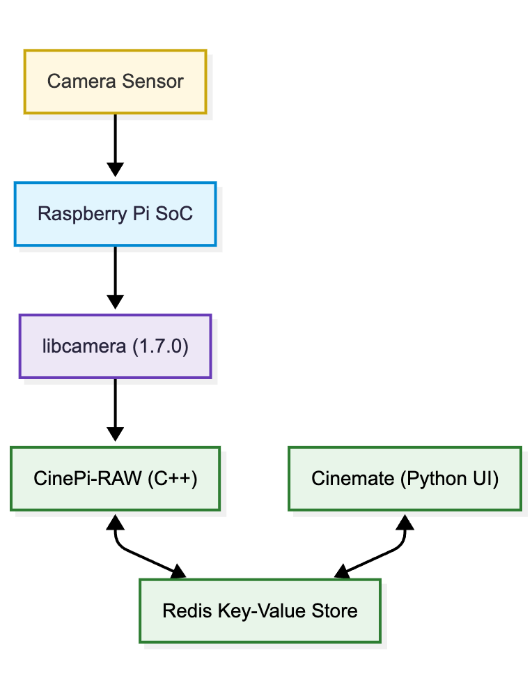

# What is it?
**Cinemate** is a boilerplate cinema camera system for Raspberry Pi 5.  builds upon CinePi-raw, authored by Csaba Nagy for enabling 12 bit (or even 16 bit) Cinema DNG recordings using off-the-shelf components.  

Cinemate provides a minimal starting point that you can extend with your own controls and accessories. 

The project combines a Python UI with a custom fork of [cinepi-raw](https://github.com/Tiramisioux/cinepi-raw/tree/rpicam-apps_1.7_custom_encoder).

## New features in version 3.3

- synchronous sound recording via attached USB microphone
- audio gain setting in `settings.json` 
- proper wav timecode – automatically merges with dng clips in DaVinci Resolve
- rec tone output
- HDMI hotplugging – display doesn't have to be connected on startup
- clearer drop frame indication
- exfat support
- new service clearing redis logs
- updated documentation
- improvements to startup/shutdown sequence and general boot performance – Cinemate now exits to the CLI and also guides on syntax errors in `settings.json`

## Compatible sensors

- IMX477 (official Raspberry Pi HQ camera)
- IMX296 (official Raspberry Pi GS camera)
- IMX283 ([OneInchEye](https://www.tindie.com/products/will123321/oneincheye-v20/) by Will Whang)
- IMX585 ([Starlight Eye](https://www.tindie.com/products/will123321/starlighteye/) by Will Whang)

## Preinstalled hardware

- [CFE Hat](https://www.tindie.com/products/will123321/cfe-hat-for-raspberry-pi-5/)
- [Grove Base Hat](https://wiki.seeedstudio.com/Grove_Base_Hat_for_Raspberry_Pi/)
- [Adafruit I2C Quad Rotary Encoder](https://www.adafruit.com/product/5752)

## Camera stack
<br>
Apps change settings by updating Redis keys. CinePi-RAW listens for those updates and captures frames accordingly while Cinemate provides the camera user interface.

## Hardware
For a basic Cinemate setup you need:
- Raspberry Pi 4 or 5
- Official HQ or GS camera module
- SSD drive such as a Samsung T7 formatted `ext4` and labelled `RAW`
- HDMI monitor or a phone/tablet connected to the Pi hotspot for preview

## Installation
There are three options for installing Cinemate:

### 1. Use the prebuilt image file

See the [releases section](https://github.com/Tiramisioux/cinemate/releases) for the preinstalled image and Quick Start Guide.

### 2. Clone the repo and run the one-click installer

```bash
sudo apt update
sudo apt install -y git
git clone https://github.com/Tiramisioux/cinemate.git
cd cinemate
chmod +x cinemate-install.sh
./cinemate-install.sh
```

This assumes Raspberry Pi OS Lite (Bookworm) is installed. 

The installer defaults to an `imx477` on camera port `cam0` and writes a stock-style managed `/boot/firmware/config.txt` section with camera options for IMX477, IMX296, IMX283, IMX585 color, and IMX585 mono. To install directly for another sensor, pass `SENSOR_MODEL` and `CAM_PORT` inline:

```bash
SENSOR_MODEL=imx296 CAM_PORT=cam0 ./cinemate-install.sh
SENSOR_MODEL=imx283 CAM_PORT=cam0 ./cinemate-install.sh
SENSOR_MODEL=imx585 CAM_PORT=cam0 ./cinemate-install.sh
SENSOR_MODEL=imx585_mono CAM_PORT=cam1 ./cinemate-install.sh
```

After installing, reboot the system and Cinemate should start automatically. The installer also enables console auto-login for the configured `PI_USER` on `tty1`; set `ENABLE_CONSOLE_AUTOLOGIN=0` if you want to keep the normal login prompt. On Raspberry Pi 4-family boards, Cinemate launches IMX296 and IMX477 with packed CinePi-RAW modes; Raspberry Pi 5 stays on unpacked modes.

### 3. Manual install

For the full manual install, configuration steps, and CLI reference, please see the [documentation](https://tiramisioux.github.io/cinemate/installation-steps/). The manual section begins after the installer instructions on that page and assumes Raspberry Pi OS Lite (Bookworm).

## Customization
GPIO buttons and switches, rotary encoders and oled display for controlling camera settings such as recording, iso etc. are configured in the `~/cinemate/src/settings.json` file.

## Documentation
Full manual installation instructions, configuration guides and CLI reference live [here](https://tiramisioux.github.io/cinemate/).

Join the [CinePi Discord](https://discord.gg/Hr4dfhuK) for discussions and sharing builds.

## Acknowledgements

The [**Cinemate**](https://github.com/Tiramisioux/cinemate) stack is built on top of several open-source projects. Special thanks to all authors!

- [**CinePi-raw**](https://github.com/cinepi/cinepi-raw) – Csaba Nagy
- [**IMX585 and IMX283 drivers**](https://github.com/will127534) – Will Whang
- [**libcamera**](https://libcamera.org) – Ideas on board
- [**cpp-mjpeg-streamer**](https://github.com/nadjieb/cpp-mjpeg-streamer) – Nadjieb Mohammadi
- [**lgpio**](https://github.com/joan2937/lg) – Joan
- [**PiShrink**](https://github.com/Drewsif/PiShrink) - Drew Bonasera 

Also thanks to Simon at [Altcinecam](https://altcinecam.com) for support and assistance!

Get your sensors and CFE Hats here: https://www.tindie.com/stores/will123321/

## Supporting the project

[](https://ko-fi.com/G2G21IM9RO)
