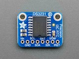

# Cinemate

**Cinemate** is an open-source boilerplate for building your own digital cinema camera on a Raspberry Pi 4 or 5. It records CinemaDNG raw video using off-the-shelf parts, and provides a minimal starting point you can extend with your own controls and accessories.

It pairs a lightweight Python interface with a custom fork of [cinepi-raw](https://github.com/Tiramisioux/cinepi-raw), built on the [CinePi-RAW recorder by Csaba Nagy](https://github.com/cinepi).

## Features

- 10/12-bit CinemaDNG recording, plus 16-bit [ClearHDR](https://tiramisioux.github.io/cinemate/clear-hdr/) on the IMX585
- [CineMate Log](https://tiramisioux.github.io/cinemate/cinemate-log/) — log-companded DNGs on the IMX585 and IMX283, 17–37 % smaller, decoded back to linear automatically by any DNG-aware app
- [Dual sensors](https://tiramisioux.github.io/cinemate/dual-sensors/) — two libcamera-synchronised sensors, side-by-side / picture-in-picture HDMI preview, per-sensor recording
- [Web GUI](https://tiramisioux.github.io/cinemate/web-gui/) on the Pi's own hotspot, plus a browser [settings editor](https://tiramisioux.github.io/cinemate/settings-editor/) for `settings.jsonc`, `config.txt` and the RAW drive
- [Web API](https://tiramisioux.github.io/cinemate/web-api/) — build wireless controllers and tally lights from an ESP32, Pico W or M5Stack ([Building control units](https://tiramisioux.github.io/cinemate/building-control-units/))
- GPIO buttons, switches, rotary encoders, pots and an OLED, mapped in one settings file ([Additional hardware](https://tiramisioux.github.io/cinemate/hardware-controls/))
- Multi-drive RAW hot-swap with a standby drive; SSD, NVMe or CFE Hat storage
- [Recovery console](https://tiramisioux.github.io/cinemate/recovery-console/) on `:8080` that stays reachable when Cinemate itself won't start

See the [changelog](https://tiramisioux.github.io/cinemate/changelog/) for what's new in version 3.4.0.

## Required hardware

For a basic Cinemate setup you need:
- Raspberry Pi 4 or 5 / CM5 with **4 GB RAM or more**. 2 GB boards run the prebuilt image, but are not recommended for UHD/4K: raw frames are buffered in RAM and a watchdog auto-stops recording once total RAM use hits 80 %. 4 GB is also recommended for compiling `cinepi-raw` on the Pi.
- Official HQ or GS camera module
- SSD drive such as a Samsung T7 formatted as `exFAT` or `ext4` and labelled `RAW`
- HDMI monitor or a phone/tablet connected to the Pi hotspot for preview

## Compatible sensors

- IMX477 (official Raspberry Pi HQ camera)
- IMX296 (official Raspberry Pi GS camera)
- IMX283 ([OneInchEye](https://www.tindie.com/products/will123321/oneincheye-v20/) by Will Whang)
- IMX585 ([Starlight Eye](https://www.tindie.com/products/will123321/starlighteye/) by Will Whang)

## Additional hardware

All of it optional — add what you need, when you need it. Drivers and mappings come preinstalled.

| Hardware | Connects to | Typical use |  |
|---|---|---|---|
| Push buttons | any free GPIO pin + GND | start/stop recording, change resolution |  |
| Two- and three-way switches | GPIO pins + GND | zoom, shutter sync mode, fps presets |  |
| Rotary encoders | two GPIO pins (+ button pin) + GND | stepping ISO, shutter angle, fps, WB |  |
| Potentiometers | a Grove Base HAT analog port | dials for ISO, shutter angle, fps, WB |  |
| [Grove Base HAT](https://wiki.seeedstudio.com/Grove_Base_Hat_for_Raspberry_Pi/) | GPIO header | analog inputs for potentiometers |  |
| [Adafruit quad rotary encoder](https://www.adafruit.com/product/5752) | I²C (STEMMA QT or SDA/SCL pins) | four dials and push buttons in one module |  |
| [CFE Hat](https://www.tindie.com/products/will123321/cfe-hat-for-raspberry-pi-5/) | PCIe (Raspberry Pi 5 only) | fast storage (CFexpress Type B) |  |
| LEDs | a GPIO out pin + GND, via a resistor | rec tally lamp |  |
| Resistor | in series with an LED | limits the LED's current; 220 Ω is a good value |  |
| I²C OLED display | I²C (SDA/SCL pins) | status screen: ISO, timecode, space left |  |
| Real-time clock | I²C (SDA/SCL pins) | keeps the clock across a power cycle, Pi 4 only |  |

Physical controls are mapped in [`settings.jsonc`](#customization). CineMate uses **BCM** pin numbering — the `GPIO n` labels, not the physical pin positions. Full reference: [Additional hardware](https://tiramisioux.github.io/cinemate/hardware-controls/).

## Camera stack
<br>

## Installation

There are three options for installing Cinemate:
### 1. Use the prebuilt image file

See the [releases section](https://github.com/Tiramisioux/cinemate/releases) for the preinstalled image and Quick Start Guide.

### 2. Clone the repo and run the one-click installer

Start from a fresh Raspberry Pi OS Lite Bookworm image. SSH to the Pi (Terminal on macOS, PowerShell on Windows):

```bash
ssh pi@raspberrypi.local
```

Replace `pi` with the username configured in Raspberry Pi Imager if you used a different user. If `raspberrypi.local` does not resolve, use the Pi's IP address instead:

```bash
ssh pi@<pi-ip-address>
```

```bash
sudo apt update
sudo apt install -y git
git clone https://github.com/Tiramisioux/cinemate.git
cd cinemate
chmod +x cinemate-install.sh
./cinemate-install.sh
```

The installer defaults to an `imx477` on camera port `cam0` and writes a stock-style managed `/boot/firmware/config.txt` section with camera options for IMX477, IMX296, IMX283, IMX585 color, and IMX585 mono ([sensors and frame rates](https://tiramisioux.github.io/cinemate/sensors/)). The IMX283 and IMX585 drivers are installed either way, so you can install with the defaults and then pick your sensor in the browser, on the settings editor's [config.txt tab](https://tiramisioux.github.io/cinemate/config-txt/).

Naming the sensor up front still matters in two cases: `imx585_mono` also applies the `rp1-cfe` kernel patch that mono 16-bit [ClearHDR](https://tiramisioux.github.io/cinemate/clear-hdr/) needs, and `imx585` also installs the IR filter helper. Neither happens when you switch sensor in the browser later.

After installing, reboot the system and Cinemate should start automatically.

### 3. Manual install

For the full manual install, configuration steps, and CLI reference, please see the [documentation/manual installation steps](https://tiramisioux.github.io/cinemate/installation-steps/).

## First run

After boot, the HDMI monitor shows the live preview with the camera GUI. To use a phone or laptop instead:

1. Join the Pi's Wi-Fi hotspot **CinePi** (password `11111111`).
2. Open `http://cinepi.local:5000` — live preview and controls. Tap the preview to start and stop recording. A clean feed without the GUI is at `cinepi.local:8000/stream`, and the settings editor at `cinepi.local:5000/settings-editor`.
3. Attach a drive formatted `exFAT` (or `ext4`) and labelled `RAW`.
4. For a physical record button, wire a momentary button between **GPIO7** and **GND** — physical pins 26 and 25, right next to each other.

<br>
<em>The live view at <code>cinepi.local:5000</code>. Frame rate, shutter, exposure, EI, white balance and the sensor mode run across the top; media space, write speed, buffer fill and Pi temperature across the bottom. Tap the picture to start and stop recording.</em>

See the [Quick start](https://tiramisioux.github.io/cinemate/getting-started/) for the full walkthrough.

## Customization
GPIO buttons and switches, rotary encoders and oled display for controlling camera settings such as recording, iso etc. are configured in the `~/cinemate/settings.jsonc` file. On the Pi, type `editsettings` in the terminal to open this file, or use the settings editor at `cinepi.local:5000/settings-editor` from a browser.

<br>
<em>The settings editor's <strong>GPIO in</strong> pane writes the same <code>settings.jsonc</code> by hand-editing it. Each row is one wired pin: the gesture on the left (press, single/double/triple click, hold, or a switch's on and off), the command it runs on the right. Buttons, two- and three-way switches and rotary encoders are added from the buttons underneath, and an I²C quad rotary board appears as its own four encoders.</em>

## Documentation
Full manual installation instructions, configuration guides in the [documentation](https://tiramisioux.github.io/cinemate/).

## Community

Join the [CinePi Discord](https://discord.gg/Hr4dfhuK) for discussions and sharing builds.

## Acknowledgements

The [**Cinemate**](https://github.com/Tiramisioux/cinemate) stack is built on top of several open-source projects. Special thanks to all authors!

- [**CinePi-raw**](https://github.com/cinepi/cinepi-raw) – Csaba Nagy
- [**IMX585 and IMX283 drivers**](https://github.com/will127534) – Will Whang
- [**libcamera**](https://libcamera.org) – Ideas on board
- [**cpp-mjpeg-streamer**](https://github.com/nadjieb/cpp-mjpeg-streamer) – Nadjieb Mohammadi
- [**lgpio**](https://github.com/joan2937/lg) – Joan
- [**PiShrink**](https://github.com/Drewsif/PiShrink) - Drew Bonasera

Also thanks to Simon at [Altcinecam](https://altcinecam.com) for support and assistance!

Get your sensors and CFE Hats here: https://www.tindie.com/stores/will123321/

## Supporting the project

[](https://ko-fi.com/G2G21IM9RO)
