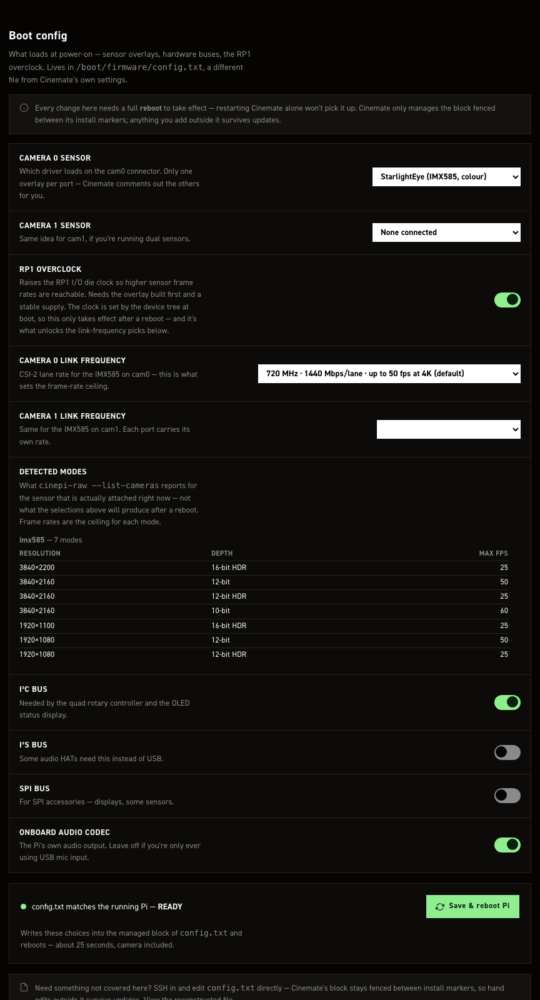

# Boot config (config.txt)

!!! warning "This file can stop the Pi booting"
    A bad `config.txt` can leave the camera unbootable, with no way to fix it from the Pi itself.
    Read [The danger](#the-danger) before you save.

`/boot/firmware/config.txt` declares the camera sensor and switches on the hardware buses and the
RP1 overclock. Edit it from the settings editor's **config.txt** tab (`boot & sensors`):

```
http://cinepi.local:5000/settings-editor/
```

The tab edits only the block CineMate owns, fenced by two marker lines:

```
# >>> cinemate-install >>>
...
# <<< cinemate-install <<<
```

A save rewrites the camera section (between `# ---- Camera section ----` and
`# ---- End camera section ----`) and the `dtparam=i2c_arm=on` / `dtparam=i2s=on` /
`dtparam=spi=on` / `dtparam=audio=on` / `dtoverlay=rp1-overclock` lines. Every other line, in the
fence or outside it, is untouched. The camera section is replaced wholesale: the installer's five
commented example blocks, one per sensor, collapse on the first save to `camera_auto_detect=` plus
your overlay lines, and never come back.

Hand edits outside the fence survive this page and `cinemate-update.sh`, which never touches
`config.txt`. They do not survive a re-run of `cinemate-install.sh`: `configure_boot_config()`
rewrites the whole file as the managed block alone, copying the old one to the installer's backup
directory.

With no `cinemate-install` fence the page shows stock defaults, warns (*config.txt has no managed
block yet — showing stock defaults*) and refuses to save. An unreadable file shows the same
defaults with a different warning, and the save fails on the read.

Arriving at the tab refetches `config.txt`, unless you have unsaved edits here, which are kept
instead.



| Control | Type | What it writes |
|---|---|---|
| **Camera 0 sensor** | Menu | `dtoverlay=<model>,cam0` in the camera section |
| **Camera 1 sensor** | Menu | `dtoverlay=<model>,cam1` in the camera section |
| **RP1 overclock** | Toggle | Comments or uncomments `dtoverlay=rp1-overclock`. Switching it *on* when the block has no such line is refused with an error |
| **Camera 0 link frequency** | Menu | `,link-frequency=<Hz>` on the cam0 overlay line |
| **Camera 1 link frequency** | Menu | `,link-frequency=<Hz>` on the cam1 overlay line |
| **Detected modes** | Read-only | Nothing. Reports what is attached now |
| **I²C bus** | Toggle | `dtparam=i2c_arm=on` |
| **I²S bus** | Toggle | `dtparam=i2s=on` |
| **SPI bus** | Toggle | `dtparam=spi=on` |
| **Onboard audio codec** | Toggle | `dtparam=audio=on` |

Both sensor menus carry the same six entries:

| Menu entry | Overlay written |
|---|---|
| Raspberry Pi HQ Camera (IMX477) | `dtoverlay=imx477,camN` |
| Global Shutter Camera (IMX296) | `dtoverlay=imx296,camN` |
| OneInchEye (IMX283) | `dtoverlay=imx283,camN` |
| StarlightEye (IMX585, colour) | `dtoverlay=imx585,camN` |
| StarlightEye (IMX585, mono) | `dtoverlay=imx585,camN,mono` |
| None connected | no overlay line for that port |

Camera 0 lists them in that order and starts on IMX477; camera 1 lists **None connected** first and
starts there. Mono is IMX585-only. The ports are independent. `camera_auto_detect=1` is written when
at least one port has a sensor, `camera_auto_detect=0` when both are **None connected**, where the
section carries a single `# no camera overlay selected` line instead of an overlay.

Cards that are not always on screen:

| Card | Appears when |
|---|---|
| **RP1 overclock** | The managed block holds a `dtoverlay=rp1-overclock` line to flip, commented or not. `cinemate-install.sh` writes it on Pi 5 / CM5 only. On the stock defaults shown with no fence, the card follows a board test instead: `bcm2712` in `/proc/device-tree/compatible` |
| **Camera 0 / 1 link frequency** | The sensor picked for that port has a selectable link frequency: today StarlightEye (IMX585, colour and mono) and OneInchEye (IMX283), listed in `resources/sensors.json`. IMX477 has values recorded there but its menu is held back |

**Detected modes** lists what `cinepi-raw --list-cameras` reports for the sensor attached right now:
a Resolution / Depth / Max fps table per camera, headed by sensor model and mode count. `50 (capped
from 60)` means a `custom_modes` ceiling in `settings.jsonc` overrides the sensor. The menu picks
above it take effect only after the reboot.

### Link frequency

The menu is greyed out while **RP1 overclock** is off, including for OneInchEye (IMX283), whose only
alternative rate is *slower* than its default. Where the RP1 card is hidden, the link menus stay
greyed for good. Pick a non-default rate with the overclock off and the card warns: without the
overclock the RP1 caps out near 43.8 fps at 4K whatever the sensor sends.

Entries read as MHz, Mbps per lane, then the published 4K frame rate where `sensors.json` records
one, today IMX585 only: `720 MHz · 1440 Mbps/lane · up to 50 fps at 4K (default)`. IMX283's two
entries stop at the Mbps figure. Entries the RP1 is not specified for are suffixed
`— over RP1 spec`.

The value is written only when it differs from that sensor's default. A value the sensor does not
support is rejected by the server, and nothing is written.

IMX283's non-default rate needs the `link-frequency` overlay parameter, which exists only in the
`6.12.y` branch of `Tiramisioux/imx283-v4l2-driver` at `257c9cf` or later. An older overlay rejects
it and the camera will not enumerate.

### Top bar

**Save changes** is the only control that writes. **Revert** loads stock defaults into the form,
**Upload** loads a `config.txt` you pick (rejected unless it has a managed block), **Download**
saves the form state as a file, and the **config.txt** button (*View raw file*) opens the drawer.

The drawer previews your choices, not the file's bytes: it regenerates a canonical managed block
from the form, so it omits everything outside the fence and any hand-added lines inside it that a
real save preserves.

### Switch to a different sensor

1. Connect the sensor to cam0 or cam1 with the Pi powered off.
2. Power up and browse to `http://cinepi.local:5000/settings-editor`.
3. Click the **config.txt** tab.
4. Pick your sensor in **Camera 0 sensor**.
5. Pick a second sensor in **Camera 1 sensor**, or leave it on **None connected**.
6. Click the **config.txt** button in the top bar to read the reconstructed file.
7. Read the danger note below.
8. Click **Save changes**. The Pi writes `config.txt` and reboots.
9. Wait about 25 seconds for the Pi to come back, camera included.
10. Reload and check **Detected modes** lists the sensor you fitted.

**Save changes** is disabled until you change something here, and is the only dirty indicator; the
"N unsaved" pill from the settings.jsonc tab does not appear. Revert and Upload arm it too, without
writing anything.

**Save & reboot Pi** on the tab only plays the reboot sequence in the console strip under it: no
write, no reboot, no server call. **Reboot Pi** in the settings.jsonc danger zone scrolls here and
clicks it. The write and the reboot both come from **Save changes** in the top bar.

### The danger

!!! danger "Saving here reboots the Pi immediately — no confirm, no revert, no backup"
    **Save changes** writes `/boot/firmware/config.txt` and reboots the Pi about 0.4 seconds later. A recording in progress is stopped first. No confirmation dialog, no countdown, no copy of the previous file.

    The [recovery console](recovery-console.md) differs: its `config.txt` editor backs up the previous file on every save and arms a confirm-or-revert countdown (5 minutes by default), restoring the old file and rebooting again if you do not confirm.

    A `config.txt` that stops the Pi booting cannot be fixed from anything running on the Pi — see [The honest limit](recovery-console.md#the-honest-limit). Recovery means pulling the SD card and editing the file on another machine.

    That fallback is **disabled by default**: set `system.recovery.allow_config_txt` to `true` in `settings.jsonc` first.

Check the reconstructed file (top-bar **config.txt** button, or the **View the reconstructed file**
link at the foot of the tab) before saving. Sensor overlay and link-frequency picks are the ones
that cost you a boot.

If the `# ---- Camera section ----` / `# ---- End camera section ----` pair has been removed by
hand, the save still succeeds and still reboots, but the sensor and link-frequency picks are
silently dropped and only the bus and overclock toggles apply. Leave those marker lines alone.

### Everything here needs a reboot

Nothing on this tab takes effect until the Pi restarts, including turning the RP1 overclock *off*
again. Neither **System → Restart CineMate** nor `restart cinemate` on the CLI reads this file.

## Hand edits

```bash
editboot
```

That opens `/boot/firmware/config.txt` in nano. Without the alias:

```bash
sudo nano /boot/firmware/config.txt
```

Uncomment the block for your sensor, comment out the others, then run `sudo reboot`. The
clean-install default is `imx477` on `cam0`. Nothing validates what you type and nothing reboots for
you.

!!! note ""
    For a dual-sensor setup, attach both sensors and give each port its own overlay line:

    ```shell
    dtoverlay=imx296,cam0
    dtoverlay=imx296,mono,cam1
    ```

### The file the installer writes

```shell
# >>> cinemate-install >>>
# Managed by cinemate-install.sh
# For more options and information see
# http://rptl.io/configtxt
# Some settings may impact device functionality. See link above for details

# Uncomment some or all of these to enable the optional hardware interfaces
dtparam=i2c_arm=on
#dtparam=i2s=on
#dtparam=spi=on

# Enable audio (loads snd_bcm2835)
dtparam=audio=on

# ---- Camera section ----

# Raspberry Pi HQ camera (IMX477, clean-install default on cam0)
camera_auto_detect=1
dtoverlay=imx477,cam0

# Raspberry Pi GS camera (IMX296, 10-bit RAW)
#camera_auto_detect=1
#dtoverlay=imx296,cam0

# OneInchEye (IMX283)
#camera_auto_detect=0
#dtoverlay=imx283,cam0

# StarlightEye color (IMX585)
#camera_auto_detect=0
#dtoverlay=imx585,cam0

# StarlightEye Mono (IMX585 mono)
#camera_auto_detect=0
#dtoverlay=imx585,cam1,mono

# ---- End camera section ----

# Automatically load overlays for detected DSI displays
display_auto_detect=1

# Automatically load initramfs files, if found
auto_initramfs=1

# Enable DRM VC4 V3D driver
dtoverlay=vc4-kms-v3d
max_framebuffers=2

# Don't have the firmware create an initial video= setting in cmdline.txt.
# Use the kernel's default instead.
disable_fw_kms_setup=1

# Run in 64-bit mode
arm_64bit=1

# Disable compensation for displays with overscan
disable_overscan=1

# Run as fast as firmware / board allows
arm_boost=1

# ---- RP1 overclock (Pi 5, optional) ----
# Raises imx585 ClearHDR frame rates. Uncomment and reboot to enable;
# re-comment and reboot to return to stock. See docs/overclocking.md.
#dtoverlay=rp1-overclock

[cm4]
# Enable host mode on the 2711 built-in XHCI USB controller.
# This line should be removed if the legacy DWC2 controller is required
# (e.g. for USB device mode) or if USB support is not required.
otg_mode=1

[cm5]
dtoverlay=dwc2,dr_mode=host

# CFE Hat PCIe 3.0
dtparam=pciex1
dtparam=pciex1_gen=3

[all]
auto_initramfs=1
avoid_warnings=1
disable_splash=1
hdmi_ignore_cec_init=1
dtparam=i2c1=on
dtoverlay=disable-bt
# <<< cinemate-install <<<
```
