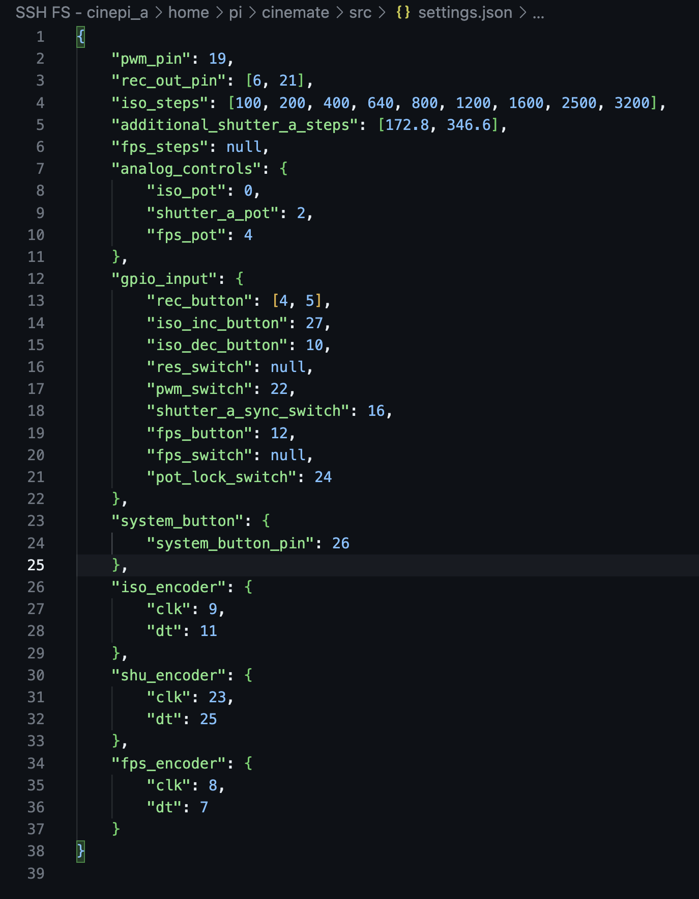

# Customizing Camera Functions and GPIO Settings

The settings file can be found in `cinemate/src/settings.json`. Here the user can define their own buttons, switches, rotary encoders, and combined actions, modifying the table above.

## General Settings

Define your hardware setup and desired application behavior:

    {
    "pwm_pin": 19,
    "rec_out_pin": [6, 21],
    "iso_steps": [100, 200, 400, 640, 800, 1200, 1600, 2500, 3200],
    "additional_shutter_a_steps": [172.8, 346.6],
    "fps_steps": null
    }

## Analog Controls

Map Grove Base HAT ADC channels to ISO, shutter angle, and FPS controls:

    "analog_controls": {
    "iso_pot": "A0",
    "shutter_a_pot": "A2",
    "fps_pot": "A4"
    }

## Buttons

Setup buttons with actions for different interactions:

    "buttons": [
    {
        "pin": 5,
        "pull_up": "False",
        "debounce_time": "0.1",
        "press_action": {"method": "rec"}
    }
    ]

Each button can be configured with a variety of actions based on different interactions:

**Press Action:** Triggers a specified method upon a simple press.

**Single, Double, and Triple Click Actions:** Specify methods to execute based on the number of successive clicks.

**Hold Action:** Executes a method when the button is held down for a longer duration.

Each action can specify a method that corresponds to a function within the application, and args, an array of arguments that the method requires.

Note that if you have both a Press Action and a Single-Click action on a pin, the pin will first execute the Press Action and when released, execute the Single-Click Action. Combining Press Action and Click actions on the same pin is therefore not recommended.

## Two-way Switches

Two-way switches are configured in the two_way_switches section and have actions for both states:

**State On Action** and **State Off Action**: Define what actions to take when the switch is turned on or off, respectively. Similar to button actions, these can specify a method and args.

    "two_way_switches": [
    {
        "pin": 16,
        "state_on_action": {"method": "set_shutter_a_sync", "args": [false]},
        "state_off_action": {"method": "set_shutter_a_sync", "args": [true]}
      },
    }
    ]

## Rotary Encoders

Configure rotary encoders for settings adjustments and optional button presses:

    "rotary_encoders": [
      {
        "clk_pin": 9,
        "dt_pin": 11,
        "button_pin": 10,
        "pull_up": "False",
        "debounce_time": "0.05",
        "button_actions": {
          "press_action": "None",
          "single_click_action": {"method": "set_iso_lock"},
          "double_click_action": "None",
          "hold_action": "None"
        },
        "encoder_actions": {
          "rotate_clockwise": {"method": "inc_iso", "args": []},
          "rotate_counterclockwise": {"method": "dec_iso", "args": []}
        }
    }
    ]

**Clockwise and Counterclockwise Actions**: Specify methods to execute when the encoder is rotated in either direction.

**Button Actions:** If the encoder has a push button, configure actions similar to standalone buttons, including press, click, and hold interactions.

## Combined Actions

Set up interactions involving multiple inputs:

    "combined_actions": [
    {
      "hold_button_pin": 13,
      "action_button_pin": 26,
      "action_type": "press",
      "action": {"method": "set_shutter_a_sync"}
    }

Combined actions allow for complex interactions involving multiple buttons or switches:

**Hold Button Pin** and **Action Button Pin:** Define the pins of the buttons involved in the combined action.

**Action Type:** Specifies the type of action required from the action_button_pin (e.g., press).

**Action:** Determines the method to execute when the combined action condition is met.
