# Additional hardware

!!! note ""
    All hardware on this page is optional. Add what you need, when you need it.

| Hardware                                                                          | Connects to                          | Typical use                                     |                                                                 |
| --------------------------------------------------------------------------------- | ------------------------------------ | ----------------------------------------------- | --------------------------------------------------------------- |
| Push buttons                                                                      | any free GPIO pin + GND              | start/stop recording, change resolution         | 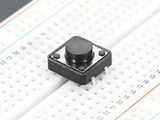              |
| Two- and three-way switches                                                       | GPIO pins + GND                      | zoom, shutter sync mode, fps presets            |                |
| Rotary encoders                                                                   | two GPIO pins (+ button pin) + GND   | stepping ISO, shutter angle, fps, WB            | 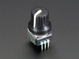                  |
| Potentiometers                                                                    | a Grove Base HAT analog port         | dials for ISO, shutter angle, fps, WB           | 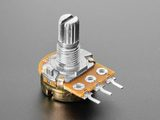           |
| [Grove Base HAT](https://wiki.seeedstudio.com/Grove_Base_Hat_for_Raspberry_Pi/)   | GPIO header                          | analog inputs for potentiometers                | 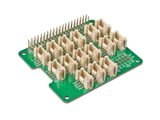                 |
| [Adafruit quad rotary encoder](https://www.adafruit.com/product/5752)             | I²C (STEMMA QT or SDA/SCL pins)      | four dials and push buttons in one module       | 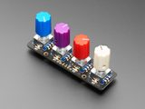 |
| [CFE Hat](https://www.tindie.com/products/will123321/cfe-hat-for-raspberry-pi-5/) | PCIe (Raspberry Pi 5 only)           | fast storage (CFexpress Type B)                 | 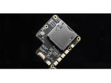                          |
| LEDs                                                                              | a GPIO out pin + GND, via a resistor | rec tally lamp                                  |                              |
| Resistor                                                                          | in series with an LED                | limits the LED's current; 220 Ω is a good value | 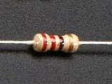         |
| I²C OLED display                                                                  | I²C (SDA/SCL pins)                   | status screen: ISO, timecode, space left        | 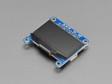               |

Physical controls are mapped in [the settings file](settings-json.md). Type `editsettings` on the Pi to open it or use the Web UI. Changes apply at the next CineMate start. Controls call the same commands as the CLI and web GUI, listed under [commands reference](cli-commands.md).

!!! info "CineMate uses BCM pin numbering"
    The numbers CineMate wants are the **GPIO n** labels, not the physical pin positions.
    GPIO 7 is physical pin 26, and GPIO 21 is physical pin 40. Full interactive reference:
    [pinout.xyz](https://pinout.xyz).

    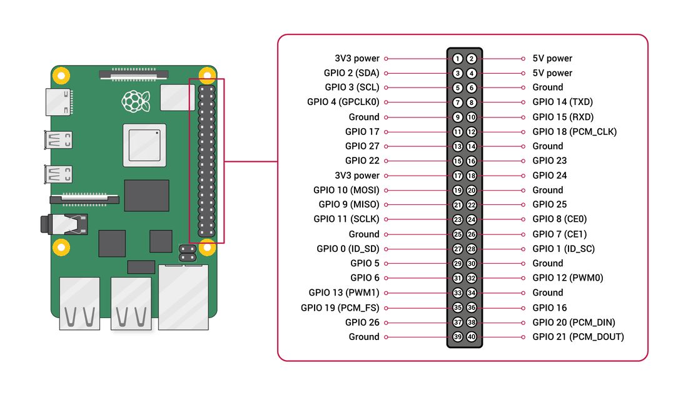

## GPIO controls in the settings editor

## Buttons

1. On the **settings.jsonc** tab, click **Buttons & switches** in the left rail.
2. Click **+ Add button**. A row appears at the bottom, GPIO **None**, one line: **Press** → **No action**.

    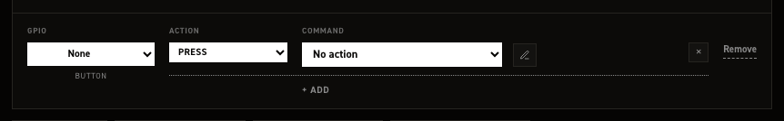

3. Open the row's **GPIO** dropdown and pick **GPIO 26**, or any pin listed in black. The stock file holds 7, 9, 10, 11, 13, 18, 21, 22 and 24.
4. **Remap this control?** appears, reading "Move a button to GPIO 26?". Click **Remap**.
5. On the **Press** line, open **COMMAND** and pick **Start / stop recording**, under **Record**.
6. Click **Save changes**.

CineMate restarts and the button is live.

### More gestures on the same button

| Gesture | Fires |
| --- | --- |
| **Press** | Immediately on press |
| **Single click** | One short click, 0.5 s after release |
| **Double click** | Two quick clicks |
| **Triple click** | Three or more quick clicks |
| **Hold** | Button held for 3 seconds |

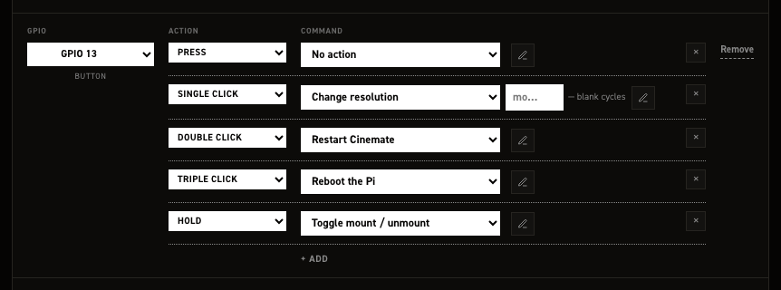

### The argument box

The box after the command is its argument. This can be used when you want the control to set a specific value.

| Blank                      | Each trigger                               |
| -------------------------- | ------------------------------------------ |
| **Cycle through the list** | Steps to the next value in **Value steps** |
| **Toggle on / off**        | Inverts the current flag                   |
| **Needs a value —**        | Does nothing until you pick one            |

### 2-way and 3-way switches

Switches react to position. At startup CineMate reads the current position and runs its line, so the camera always matches the switch.

**+ Add 2‑way switch** creates one pin and two lines:

| Line    | Runs when            |
| ------- | -------------------- |
| **On**  | The pin reads closed |
| **Off** | The pin reads open   |

**+ Add 3‑way switch** creates three pin dropdowns, **pin 1**, **pin 2**, **pin 3**, and three lines:

| Line           | Runs when                 |
| -------------- | ------------------------- |
| **Position 1** | pin 1 is the active input |
| **Position 2** | pin 2 is the active input |
| **Position 3** | pin 3 is the active input |

All three pins must be set. With no input active, no line runs.

Typical 2‑way pairing: **Set preview zoom** at **Set to 2×** on **On**, **Set to 1×** on **Off**.

### Rotary encoders

**+ Add rotary encoder** creates three pin dropdowns, **CLK**, **DT** and **BTN**.

| Pin     | Required                                             |
| ------- | ---------------------------------------------------- |
| **CLK** | Yes                                                  |
| **DT**  | Yes                                                  |
| **BTN** | No; leave **None** if the encoder has no push button |

The row starts with a single **Button press** line; **+ Add** offers the rest.

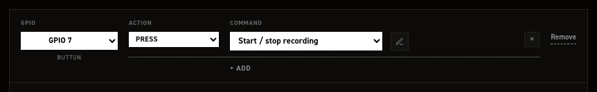

| Line             | Fires                              |
| ---------------- | ---------------------------------- |
| **Button press** | Press of the encoder's push button |
| **Button hold**  | Push button held                   |
| **Rotate CW**    | One step clockwise                 |
| **Rotate CCW**   | One step counter‑clockwise         |

!!! note ""
    Each encoder row carries an `enabled` flag in `hardware_controls.rotary_encoders`. The stock file
    ships it `true`; set it to `false` to keep a row's wiring on file while switching it off. A row
    with no `enabled` key at all is on.

### The Adafruit Quad Rotary Encoder i²c board

Sits below the GPIO in list with its own **+ Add encoder**. Its rows address the board's four encoders, not GPIO pins, so the left column offers **None** and **Encoder 0** through **Encoder 3**.

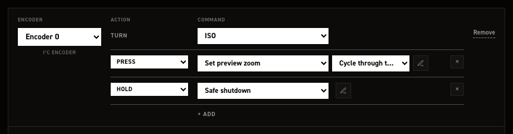

**+ Add encoder** claims the lowest free encoder index. Set the **Turn** line, what rotating the dial cycles, then add button gestures with **+ Add** as on a GPIO button.

**Turn** offers **Nothing**, **ISO**, **Shutter angle**, **Frame rate**, **White balance**, **Resolution**, **Preview zoom**, **Nominal shutter angle**, **HDR threshold low**, **HDR threshold high**, **HDR blend**, **HDR gain adder**.

The push button below **Turn** takes the full button grammar.

With all four configured, **+ Add encoder** reports "All four encoders are already configured". The stock file configures all four encoders and ships the board on: `input_peripherals.quad_rotary_controller.enabled` is `true`, and CineMate only sets the board up when it is. Set it to `false` if you are not running the board.

### GPIO out: tally and slate tone

!!! warning "Put a resistor in series with an LED"
    A GPIO pin drives 3.3 V and an LED is not current-limited on its own. Wired straight to the
    pin it will draw more than the pin can safely give and can damage both. Put a resistor in
    series with it, typically **220 Ω**, between the pin and the LED's long leg (anode), with the
    short leg (cathode) to GND. Anything from about 150 Ω to 1 kΩ works; higher is dimmer and
    safer. A relay or an opto-isolated tally box has its own driver and does not need one.

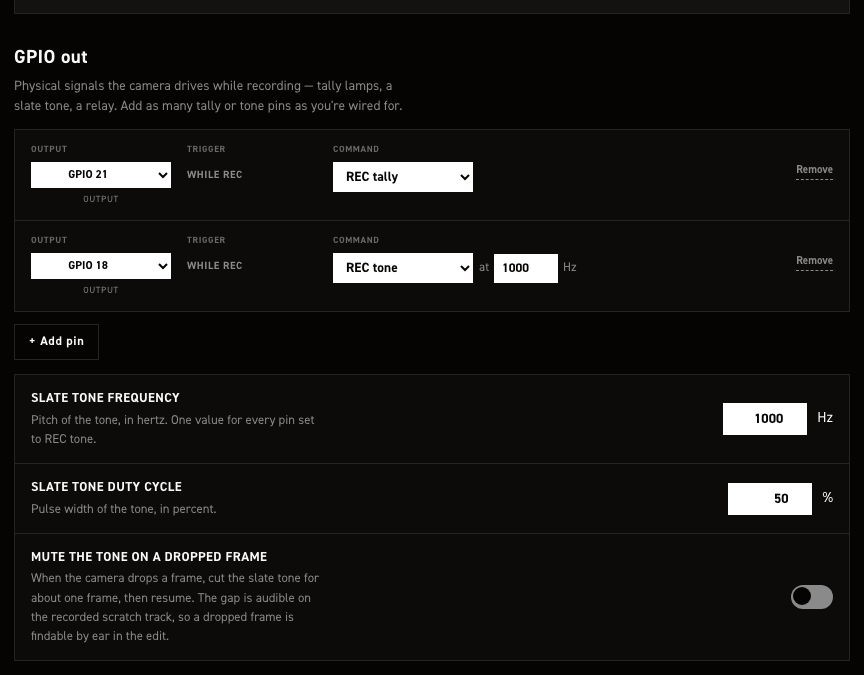

1. Click **Rec tally & GPIO out** in the left rail.
2. Click **+ Add pin**. A row appears with **Output** on **None** and a **While rec** line set to **REC tally**.
3. Pick the pin from **Output** and confirm the remap.
4. For a sync tone instead of a lamp, change **While rec** to **REC tone**.

**REC tone** reveals an **at … Hz** field in the row and three cards below the list:

| Card                                 | Sets                                                        |
| ------------------------------------ | ----------------------------------------------------------- |
| **Slate tone frequency**             | Pitch in hertz                                              |
| **Slate tone duty cycle**            | Pulse width in percent                                      |
| **Mute the tone on a dropped frame** | Cuts the tone for about one frame when the camera drops one |

One frequency serves every tone pin: the in‑row field and the card edit the same value. The cards are hidden while no pin is set to **REC tone**. Add as many tally and tone rows as you are wired for.

!!! info ""
    Some push buttons are wired closed = 1 and open = 0. At startup CineMate detects buttons that read as pressed and reverses them, so both types work without special configuration.

!!! info ""
    Only assign pot channels that have a potentiometer connected. Unconnected analog inputs pick up noise and can trigger false readings.

## CFE Hat

The [CFE Hat](https://www.tindie.com/products/will123321/cfe-hat-for-raspberry-pi-5/) by Will Whang adds a CFexpress Type B card slot to the Raspberry Pi 5 over PCIe.

No configuration needed. CineMate detects the hat at startup and shows **CFE** as the media type. Format the card `exFAT` and label it `RAW`, like any recording drive: the RAW files pane has a format button, `format exfat` does the same in the CLI.

## Outputs and displays

- **Rec light (tally LED)** – `hardware_outputs.rec_out_pin` (GPIO 21 stock) goes high while recording.
- **Rec sync tone** – `hardware_outputs.rec_tone.pin` (GPIO 18 stock) outputs a 1 kHz tone while recording.
- **I²C OLED display** – an SSD1306-style status screen showing values you choose (ISO, timecode, write speed, disk space…). Enable it in `output_peripherals.oled`.

Reference: [hardware_outputs](settings-json.md#hardware_outputs), [output_peripherals](settings-json.md#output_peripherals), [settings.jsonc](settings-json.md), [CineMate terminal commands](cli-commands.md).
