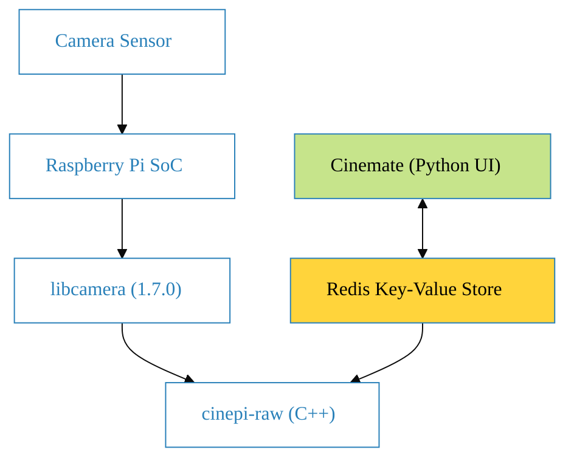
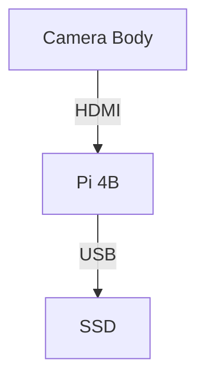
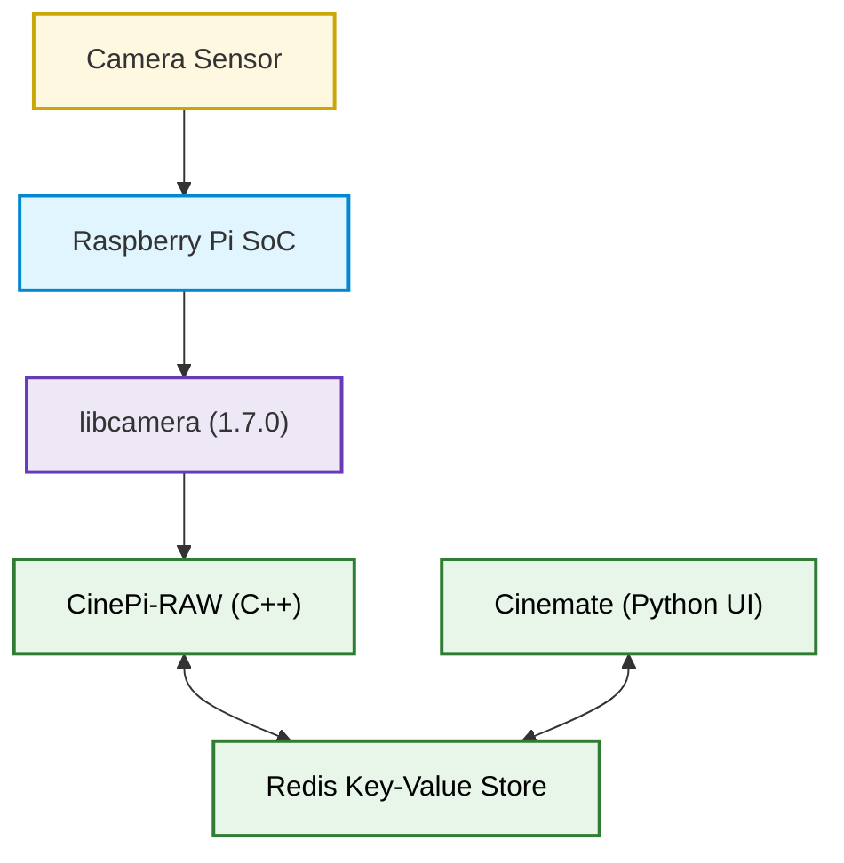

{==

Formatting can also be applied to blocks by putting the opening and closing
tags on separate lines and adding new lines between the tags and the content.

==}

    :::{tip}
    Let's give readers a helpful hint!
    :::

```bash
This is my note
```





```pddl
def bubble_sort(items):
    for i in range(len(items)):
        for j in range(len(items) - 1 - i):
            if items[j] > items[j + 1]:
                items[j], items[j + 1] = items[j + 1], items[j]
```

``` py hl_lines="2 3"
def bubble_sort(items):
    for i in range(len(items)):
        for j in range(len(items) - 1 - i):
            if items[j] > items[j + 1]:
                items[j], items[j + 1] = items[j + 1], items[j]
```

`#!math p(x|y) = \frac{p(y|x)p(x)}{p(y)}`

:::python
    # Code goes here ...

:::python hl_lines="1 3"
    # This line is emphasized
    # This line isn't
    # This line is emphasized

```python
    print('hellow world')
```

```

Text can be {--deleted--} and replacement text {++added++}. This can also be
combined into {~~one~>a single~~} operation. {==Highlighting==} is also
possible {>>and comments can be added inline<<}.

hellow world')
```