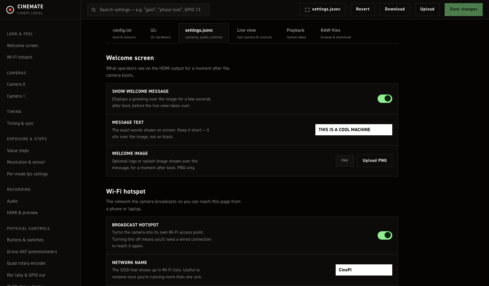
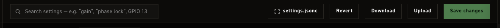
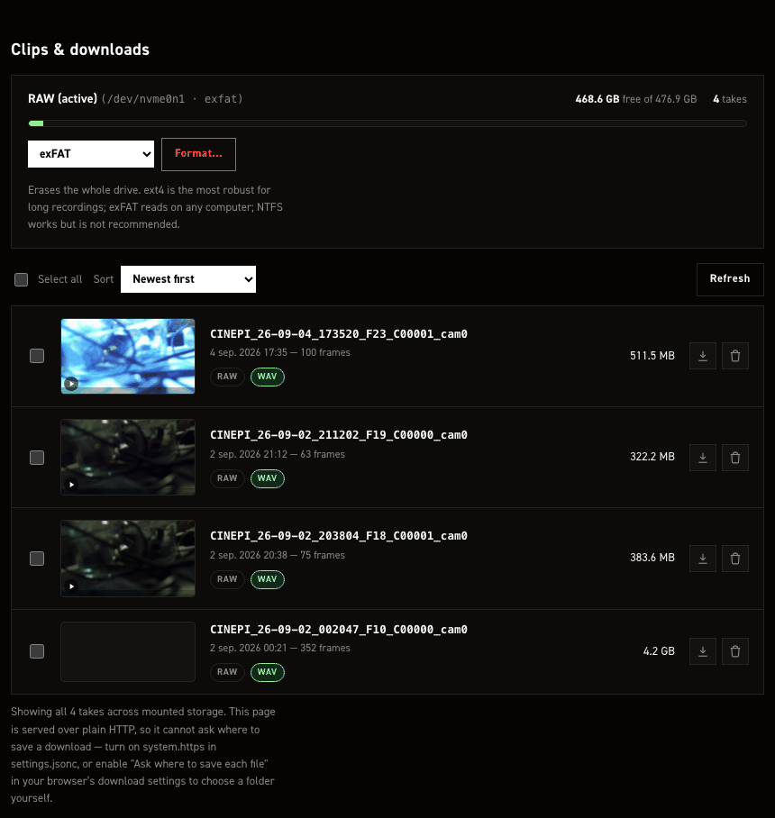
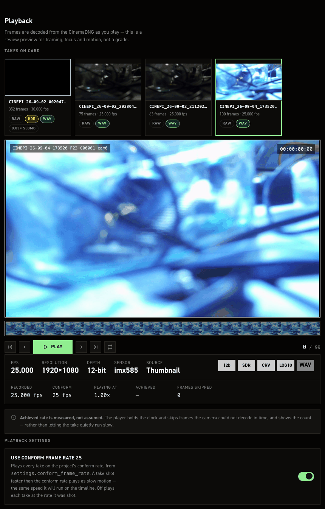

# Settings editor

A browser page for configuring and operating the camera without SSH: edit `settings.jsonc` and `/boot/firmware/config.txt`, browse and pull takes off the RAW drive, review a take's frames, and see the live camera feed — all from one page over Wi‑Fi.

It is a Flask blueprint (`src/module/app/settings_editor.py`) served by the same process as the [Web GUI](web-gui.md), so it needs CineMate itself running. For the console that stays up when CineMate won't start, see the [Recovery console](recovery-console.md) instead.

## Reaching it

```
http://cinepi.local:5000/settings-editor
```

Over the camera's own hotspot (see [Configuring the Wi-Fi hotspot](hotspot-logic.md)):

```
http://10.42.0.1:5000/settings-editor
```

## Layout



The top bar carries a search box (filters every field/take on the current tab by name) and, on the two file-editing tabs, five more controls:



| Control | Does |
|---|---|
| **N unsaved** pill | Counts the fields that differ from what the page loaded. Set a field back to its original value and it stops counting. Settings tab only, and only while something is changed |
| **View raw file** | Opens a drawer showing what the next Save would write — `settings.jsonc` or `config.txt` — with a Copy button. The button's label follows the active tab. On the settings tab this is the form's state rendered as plain JSON, so the real file's comments are not shown there |
| **Revert** | Loads the stock shipped defaults into the on-screen form only — nothing is written until you click Save |
| **Download** | Downloads the current form state as a file, for a local backup or diffing. The settings download is plain JSON and carries no comments, so it is not a like-for-like copy of the file on the card |
| **Upload** | Parses a `.json`/`.jsonc`/`.txt` file you pick and loads it into the form — again, not written until Save |
| **Save changes** | Writes the file for the active tab and applies it (see below) — disabled until something is actually dirty |

The four file controls and **Save changes** are hidden on Live view, Playback and RAW files, which edit no file. The search box stays.

Five tabs run across the top of the page:

| Tab | Edits |
|---|---|
| **config.txt** | The managed block CineMate owns inside `/boot/firmware/config.txt` — sensor overlays, hardware buses, RP1 overclock |
| **i2c** | What is attached to the camera's I²C bus, and the two clocks |
| **settings.jsonc** | Everything in `settings.jsonc`, grouped into sections (below) |
| **Live view** | The main Web GUI, embedded |
| **Playback** | Reviews a recorded take frame-by-frame off the card |
| **RAW files** | Browse, download, delete and format the mounted RAW storage |

## settings.jsonc tab

The left rail groups the same fields `settings.jsonc` holds, unchanged in meaning from the [Settings file](settings-json.md) reference — this page is a form over that file, not a different configuration surface:

| Group | Sections |
|---|---|
| Look & feel | Welcome screen (HDMI boot splash) · Wi‑Fi hotspot |
| Cameras | Camera 0 · Camera 1 — geometry, HDMI routing, USB device name, independent per sensor |
| Timing | Timing & sync — how strictly frame timing is watched before warning or flagging a take |
| Exposure & steps | Value steps (click-stops per control) · Pots & free stepping (Grove Base HAT channel assignments) · Resolution & sensor (crop factors, bit depths, ClearHDR startup values) · Per-mode fps ceilings (per-sensor-mode overrides — see `custom_modes` in the settings reference) |
| Recording | Audio (input gain, timecode alignment per bit depth) · HDMI & preview (monitor overlay, dual-feed framing) |
| Physical controls | Buttons & switches (GPIO in) · Rec tally & GPIO out · OLED status display |
| System | Restart CineMate |

Editing anything marks the page dirty (the header shows an "N unsaved" pill) but touches nothing on disk until you click **Save changes**.

### Save & restart

Clicking **Save changes** on this tab:

1. Backs up the current `settings.jsonc` to `.settings-backups/` next to it (timestamped, last 10 kept).
2. Writes your changes. If only values changed, the surgical writer keeps every comment, the key order and the file's formatting. If a key was added or removed (a structural change), it falls back to a full rewrite, which is correct but drops every comment.

    !!! warning "A structural save loses comments without saying so"
        The server composes a warning when this happens, but the page does not show it — the toast reads `Saved. Restarting Cinemate…` either way. If you keep notes in `settings.jsonc`, recover them from the newest file in `.settings-backups/` after a save that added or removed a key.

3. Restarts CineMate automatically to apply the new file — the same effect as the CLI's `restart cinemate`, not a reboot. Recording stops if one is in progress.

You can also apply a save-in-place, or just restart with nothing pending, from **System → Restart CineMate**.

## Boot config (config.txt) tab

!!! danger "No confirm, no revert — unlike the recovery console"
    Clicking **Save changes** on this tab writes `/boot/firmware/config.txt` and reboots the Pi within under a second, with **no confirm-or-revert window and no backup of the previous file**.

    This is different from the [Recovery console](recovery-console.md)'s config.txt editor, which backs up the previous file on every save and arms a 5‑minute confirm‑or‑revert countdown — reverting and rebooting automatically if you never confirm. The settings editor has none of that: if the change you save stops the Pi from booting cleanly, the only way back is the manual SD-card recovery procedure in [The honest limit](recovery-console.md#the-honest-limit).

    Double-check the change before saving, especially sensor overlay and link-frequency picks. Consider making config.txt edits through the recovery console instead when you want the safety net.

Everything here needs a full reboot to take effect — restarting CineMate alone never picks up a `config.txt` change. The page shows the detected sensor modes for whatever is actually attached right now, separately from the overlay picks above them (those apply only after the reboot). CineMate only manages its own fenced block; anything you add to the file outside it survives updates and is untouched by this page.

## i2c tab

Shows which optional hardware is answering on the camera's I²C bus right now. Everything listed is
optional — the camera records without any of it.

The bus is probed each time you open the tab, one byte read per address. Nothing here writes to the
bus, so opening this tab cannot disturb an encoder someone is turning or blank a display mid-take.

| Device | Address | Notes |
|---|---|---|
| Grove Base HAT | `0x08` | Analog inputs for potentiometers |
| Adafruit quad rotary encoder | `0x49` | Four dials and push buttons on one board |
| I²C OLED display | `0x3c` or `0x3d` | SSD1306 or SSD1309 — the two share a command set and an address, and neither has an ID register, so the pane names both rather than guessing. Shows the configured pixel size |
| Real-time clock | `0x68` | Pi 4 only — see [Additional hardware](hardware-controls.md#real-time-clock) |
| CFE Hat | `0x34` | Not really an I²C device: the card is PCIe and `0x34` is the hat's latch controller. If it does not answer there, the PCIe bridge node is checked instead, and the pane says which answered |

Each row shows the address that answered. A device that is not found says which address was tried,
so a board strapped to a different address is obvious rather than just missing.

!!! note "The display's size is configured, not detected"
    An SSD1306 has no size register — nothing on the bus can be asked how many pixels it has. The
    dimensions shown come from `output_peripherals.oled` in [settings.jsonc](settings-json.md), which
    is where CineMate reads them before telling the driver. Change them there, not here.

### The clocks

The camera's system clock sets itself whenever it can reach the internet, over Ethernet or joined
Wi-Fi. The RTC keeps whatever it was last given, so the two only agree after you copy one across.

**Sync RTC** runs `hwclock --systohc` and then reads the clock back to check it took. That readback
matters: the CLI's `set rtc time` discards `hwclock`'s exit status, so it reports success even with
no clock attached. This reports what actually happened, including the case where the write needs a
sudo rule the image does not have.

## Missing hardware on the settings tab

Sections for a board that is not answering are dimmed on the **settings.jsonc** tab, with a line
saying so — the pot channels when there is no Grove HAT, the encoder rows when there is no quad
rotary board, the OLED section when no display answers.

Dimmed does not mean disabled. The fields stay editable and their values stay in the file, so a rig
can be configured before the hardware arrives, and unplugging a board never quietly rewrites the
settings that describe it.

## RAW files tab



**Storage** shows a card per mounted drive: label, device and filesystem, free/total space, take count, and — for the active drive only — a **Format…** control. Formatting asks for confirmation, is refused while a recording is in progress, and is verified against the drive's actual filesystem after the dispatch completes rather than trusting the command succeeded.

**Takes** lists every take across all mounted storage, newest first by default (also sortable by oldest or largest), each with a thumbnail you can scrub for a quick frame check. Per take:

- **Download** — streams a zip of the take. Only one download runs at a time server-wide; a second attempt is told to wait. On a Chromium browser over a secure context (HTTPS, or localhost) it can write straight into a folder you pick; elsewhere it's a normal browser download.
- **Delete** — asks for confirmation, and is refused while that take is actively being written to.

Checking takes and using **Download selected** / **Delete selected** applies the same actions to the whole selection. Bulk delete refuses the entire request (not a partial delete) if any selected take is currently recording. Downloading more than one take at once needs the folder-picker path above.

## Playback tab



Reviews a take's frames, decoded live from the CinemaDNG files, at the settings' conform frame rate. Fully covered in [Playback](playback.md) — including the storage-contention lockout that holds playback while a take is recording or its buffer is still flushing.

## Live view tab

Embeds the main [Web GUI](web-gui.md) (the page at the site root, port 5000) in an iframe — the same live image, ISO/shutter/fps/WB controls and record button, without leaving the settings editor. Open it in its own tab if the controls feel cramped here; the clean feed with no overlay is on port 8000 (`8001` for cam1 on a dual-sensor rig).
