# settings.jsonc

Open the settings editor from a phone or laptop on the same network as the camera:

```
http://cinepi.local:5000/settings-editor/
```

On the camera's own hotspot, use `http://10.42.0.1:5000/settings-editor/` instead.

Nothing is written until you press **Save changes**, which saves the file and restarts CineMate,
stopping any recording. Every field is one key in `settings.jsonc`, which you can also
[edit by hand](#editing-the-file-directly). For the page's own mechanics (tabs, top bar, backups) see
[Settings editor](settings-editor.md).

## Welcome screen

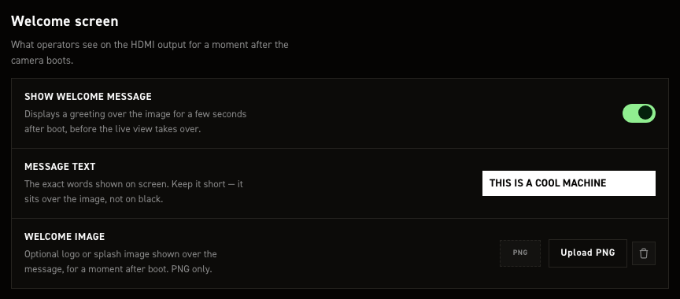

Greeting drawn on HDMI at startup, before the live view. Changes show at the next start, which saving
triggers. With Plymouth running, CineMate waits for the spinner to hand off.

| Control | What it does |
| --- | --- |
| Show welcome message | Full-screen greeting, held at least three seconds. Default on. |
| Message text | Free text, default `THIS IS A COOL MACHINE`. One centred white-on-black line, no wrapping, so keep it short. |
| Welcome image | PNG instead of the text, stretched to fill the output, so match your monitor's aspect ratio. **Upload PNG** picks it, the bin icon clears it. PNG only. Default none. |

!!! warning "Picking a PNG only records its path"
    It sets `system.welcome.image` to `resources/welcome/<filename>`, relative to CineMate's working
    directory: `/home/pi/cinemate/resources/welcome/<filename>` on the camera. Create that folder and
    copy the PNG there over SSH; the page does not, and CineMate falls back to the text. By hand, any
    absolute path and any format Pillow opens works.

These map to `system.welcome`.

## Wi-Fi hotspot

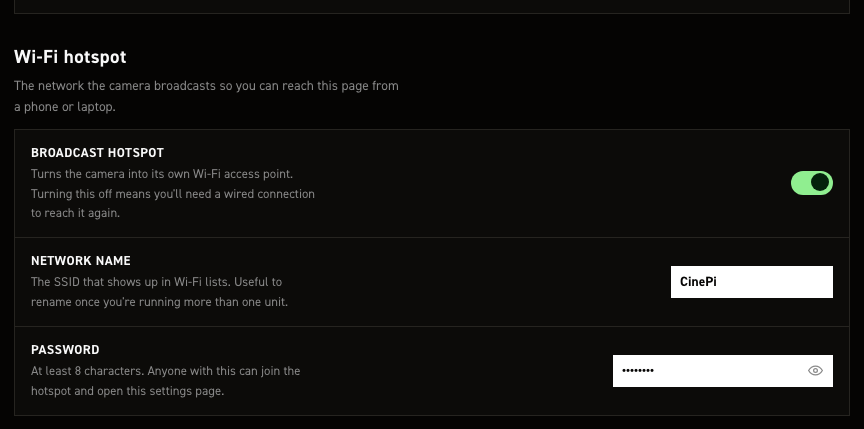

The camera broadcasts its own Wi‑Fi network, so you reach this page with no router. The toggle stops
only that broadcast; the Pi still joins your own network through `raspi-config` or the desktop tools.

| Control | What it does |
| --- | --- |
| Broadcast hotspot | Default on. Off applies **from the next boot**, so you can't strand yourself mid-session. Once down, only a wired link or a `wlan0`/`eth0` that already had an IP at CineMate start reaches this page. |
| Network name | SSID shown to phones and laptops. Ships `CinePi`. Rename it when running more than one unit. |
| Password | Ships `11111111`. 8-character minimum, unenforced here, so a shorter one saves silently. The eye button reveals it. Anyone with it can open this page. |

!!! warning "A password under 8 characters is thrown away"
    The field and `settings.jsonc` keep what you typed, but the service enforces NetworkManager's
    8‑character minimum and comes up on the shipped `11111111` instead. The only trace is a line in
    the service log. That shipped password is published here, so change it before treating the
    hotspot as private.

`wifi-hotspot.service` re-reads name and password on a 60-second reconcile pass: live within a
minute, no reboot or restart. The access-point restart drops every hotspot client, including the
device you are editing from. Full behaviour: [Wi-Fi hotspot](hotspot-logic.md).

These map to `system.wifi_hotspot`.

## Cameras

<a id="sensors"></a>

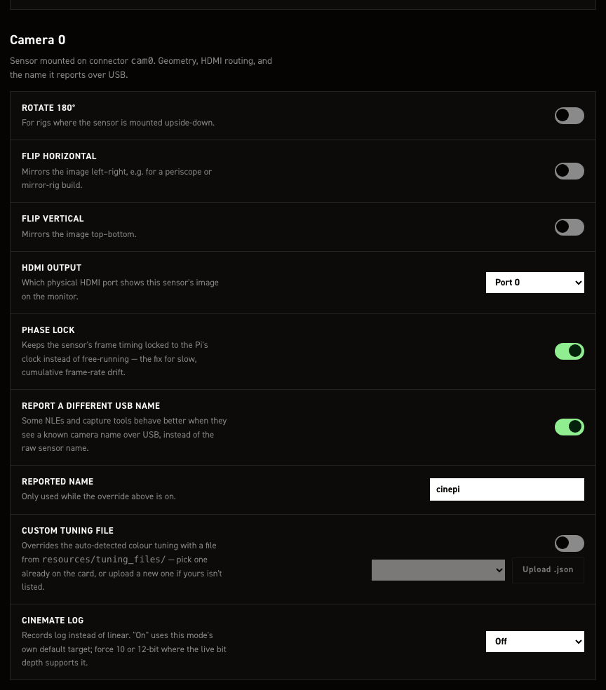

Per-sensor orientation, HDMI port, reported name and log. **Camera 0** and **Camera 1** are separate
sections with independent values. Camera 1 drops the flip and name fields and adds the rig-wide
record policy.

| Control | What it does |
| --- | --- |
| Rotate 180° | Preview and recorded frames upside-down, for an inverted mount. Default off. `sensors.cam0.geometry.rotate_180` and the matching `cam1` key. |
| Flip horizontal | Mirrors left–right, for periscope rigs. Default off. Camera 0 only. |
| Flip vertical | Mirrors top–bottom. Default off. Camera 0 only. |
| HDMI output | `Port 0` = `HDMI-A-1`, `Port 1` = `HDMI-A-2`. Camera 0 defaults to Port 0, Camera 1 to Port 1. |
| Phase lock | Locks recorded cadence to the Pi's clock instead of sensor free-run, stopping audio/video drift over long takes. Default on. Leave it on, genlocked rigs included. |
| Report a different USB name | Writes your own name into every DNG's `UniqueCameraModel` tag instead of the one `cinepi-raw` picks. Default on. Camera 0 only. |
| Reported name | Used when the toggle above is on. Ships `cinepi`. Camera 0 only. |
| Custom tuning file | Forces a colour tuning file instead of the auto-detected one. Default off; the picker lists `resources/tuning_files/` (stock `imx477.json`). Ignored on a Pi 4, which gets none. |
| Upload .json | Points the setting at `resources/tuning_files/<your file>` and selects it. Put the file on the Pi over SSH first; the page does not copy it. Non-`.json` refused. |
| CineMate Log | Log instead of linear: smaller files, same grade. Default `Off`; `On (mode default)` uses the sensor mode's target, `Force 10-bit` / `Force 12-bit` pin it. imx585 and imx283 only. A target the live mode cannot reach records plain linear DNGs. Seeds at launch; a later `set log` wins. |
| Dual-sensor record policy | **Camera 1 only, rig-wide.** `Follow preview` (default): full-screen or pip-main records one sensor, side-by-side both. `Always both` records both every time. No effect with one sensor; `rec cam0` / `rec cam1` / `rec both` overrides one take. |

!!! note "Reported name and Blackmagic"
    Resolve picks its decode pipeline from this name. `Blackmagic Pocket Cinema Camera 4K` unlocks
    the full Camera RAW tab, ISO slider and colour science included. Never combine it with CineMate
    Log; that colour science stacks on already-linearised data. Keep `cinepi` on any log camera.

!!! note "HDMI port on a headless install"
    This sets only the connector CineMate uses once running. The boot screen needs its own matching
    `video=HDMI-A-1:1920x1080M@60D` (or `HDMI-A-2`) in `/boot/firmware/cmdline.txt`.

!!! danger "A save from this page resets Camera 1's flip and name keys"
    `sensors.cam1` also holds `horizontal_flip`, `vertical_flip`, `override_camera_name` and
    `camera_name`, exposed here for Camera 0 only. The form never sends them, so a save rewrites them
    to `false`, `false`, `false`, `""` and values set over SSH are silently lost. Avoid saving here on
    a rig that depends on them.

These map to `sensors.cam0`, `sensors.cam1` and `sensors.record_policy`.

## Timing & sync

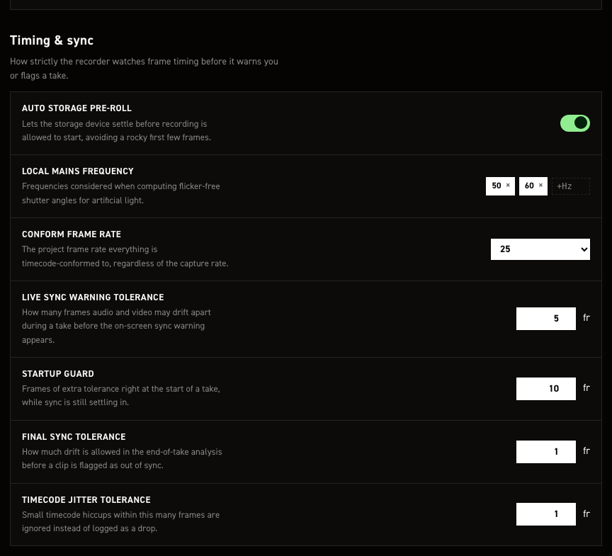

Frame-timing tolerances, the conform frame rate, and storage warm-up.

| Control | What it does |
| --- | --- |
| Auto storage pre-roll | Records and discards a short test clip at startup and on each storage mount, priming the card. Never becomes the "latest recording". Default on. Off skips only the automatic runs; CLI `storage preroll` still works ([Storage pre-roll](storage-preroll.md)). |
| Local mains frequency | Frequencies used for flicker-free shutter angles. Ships 50 and 60. Enter adds a chip, × removes one, drag to reorder. |
| Conform frame rate | What everything is timecode-conformed to. 24, 25 or 30; default 25. |
| Live sync warning tolerance | Frames the recorded count may fall behind elapsed take time before the SYNC warning latches. Shortfall only; running ahead never latches. Default 5 frames. `settings.sync_tolerances.live_sync_warning_frames`. |
| Startup guard | Frames that must elapse after record starts before the live warning can latch, covering recorder startup latency. Default 10 frames, 400 ms at 25 fps. `settings.sync_tolerances.live_sync_startup_guard_frames`. |
| Final sync tolerance | How far end-of-take analysis lets frames on disk differ from expected, either direction, before flagging the clip out of sync. Default 1 frame, stricter than the live warning. `settings.sync_tolerances.final_sync_analysis_frames`. |
| Timecode jitter tolerance | Late-but-present frames within this many frames are ignored, not logged as a drop. Default 1 frame. `settings.sync_tolerances.tc_drop_jitter_frames`. |

!!! note "Conform frame rate does not change what you shoot"
    The sensor records at the camera's own FPS. Conform sets only the timecode counter's frame base
    and the Playback pane's speed, so a take shot above it plays slow motion unless **Use conform
    frame rate** is off there. DNG timecode uses the actual capture rate.

These map to `system.storage.auto_preroll`, `settings.conform_frame_rate`, `settings.light_hz` and
`settings.sync_tolerances`.

## Value steps

<a id="arrays"></a>

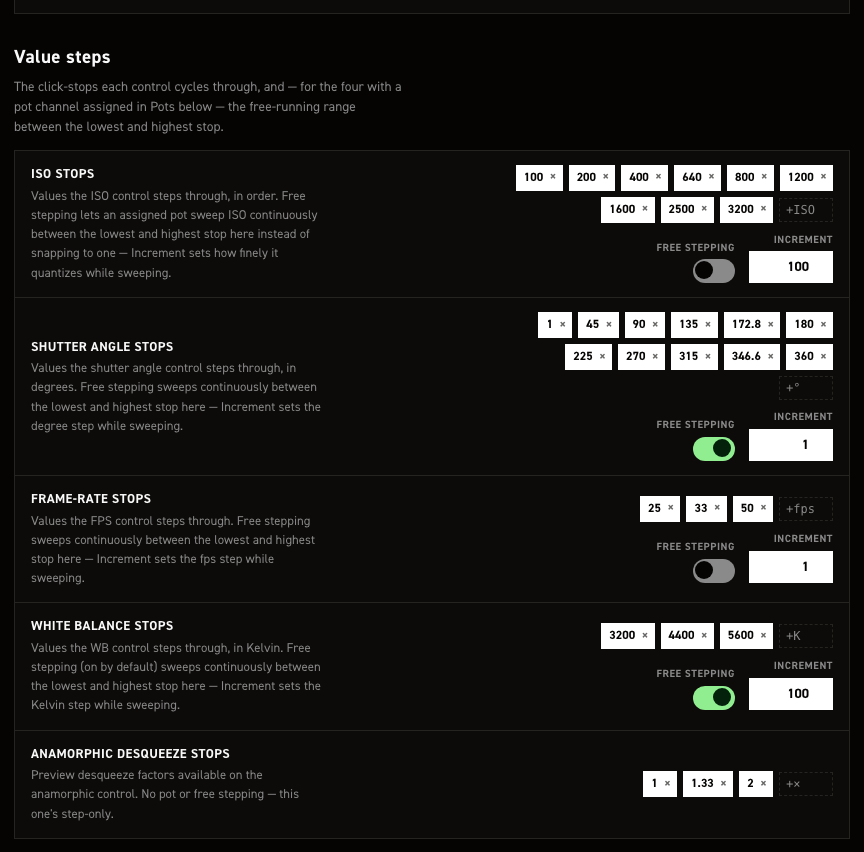

The click-stops each control cycles through. Enter adds a chip, × removes one. Numeric lists are held
lowest-first at all times, so `inc`/`dec` always walk them in order. ISO, shutter angle and frame rate
stop at the list ends; white balance and anamorphic wrap.

With free stepping on, the stops in between stop being what the control lands on, so they are dimmed
and the two ends move to the right of the row joined by an arrow — the range the control now sweeps.

| Control | What it does |
|---|---|
| ISO stops | Default 100, 200, 400, 640, 800, 1200, 1600, 2500, 3200. |
| Free stepping (ISO stops) | Sweeps from the lowest stop to the highest in `Increment` steps, instead of landing on the stops. Default off. |
| Increment (ISO stops) | Free-step size. Default 100. |
| Shutter angle stops | Degrees. Default 1, 45, 90, 135, 172.8, 180, 225, 270, 315, 346.6, 360. |
| Free stepping (Shutter angle stops) | Sweeps from the lowest stop to the highest in `Increment` steps. Default on. |
| Increment (Shutter angle stops) | Free-step size. Default 1°. |
| Frame-rate stops | Default 25, 33, 50. |
| Free stepping (Frame-rate stops) | Sweeps from the lowest stop up to the sensor mode's `fps_max` in `Increment` steps. The list's own top entry does not raise that ceiling. Default off. |
| Increment (Frame-rate stops) | Free-step size. Default 1 fps. |
| White balance stops | Kelvin. Default 3200, 4400, 5600. |
| Free stepping (White balance stops) | Sweeps from the lowest stop to the highest in `Increment` steps. Default on. |
| Increment (White balance stops) | Free-step size. Default 100 K. |
| Anamorphic desqueeze stops | Preview desqueeze factors; above 1 widens the preview, recording untouched. Step-only, no pot or free stepping. Default 1, 1.33, 2. |

Free stepping drives pots, the quad encoders, the CLI `inc`/`dec` commands and the web GUI. Assign a
pot in **Potentiometers**.

The list still sets the range when free stepping is on — its lowest and highest entries are the ends
of the sweep, so editing them moves what the control can reach. The stops in between stop mattering,
which is why the editor mutes them and leaves the two ends lit. Empty the list entirely and the
parameter falls back to its own full range.

The swept range is fixed per parameter, not your chips, whatever the card text says. Only the
increment is yours.

| Control | Free range |
|---|---|
| ISO | 100–3200 |
| Shutter angle | 1–360° |
| Frame rate | 1 fps to `fps_max` (sensor max for the mode, truncated: 49.97 gives 49) |
| White balance | 2800–6500 K |

!!! note "Two lists get edited behind your back"
    Flicker-free angles for `light_hz` (**Local mains frequency**, Timing & sync) are added to the
    shutter angle stops on every fps change and the list re-sorted, so angles you never typed appear.
    Frame-rate stops above the sensor mode's ceiling are dropped and the sensor maximum offered
    instead, so the stock 50 fps stop is not reachable in every mode.

These map to `arrays.iso`, `arrays.shutter_a`, `arrays.fps`, `arrays.wb` and
`hdmi_display.preview.anamorphic.steps`.

## Potentiometers

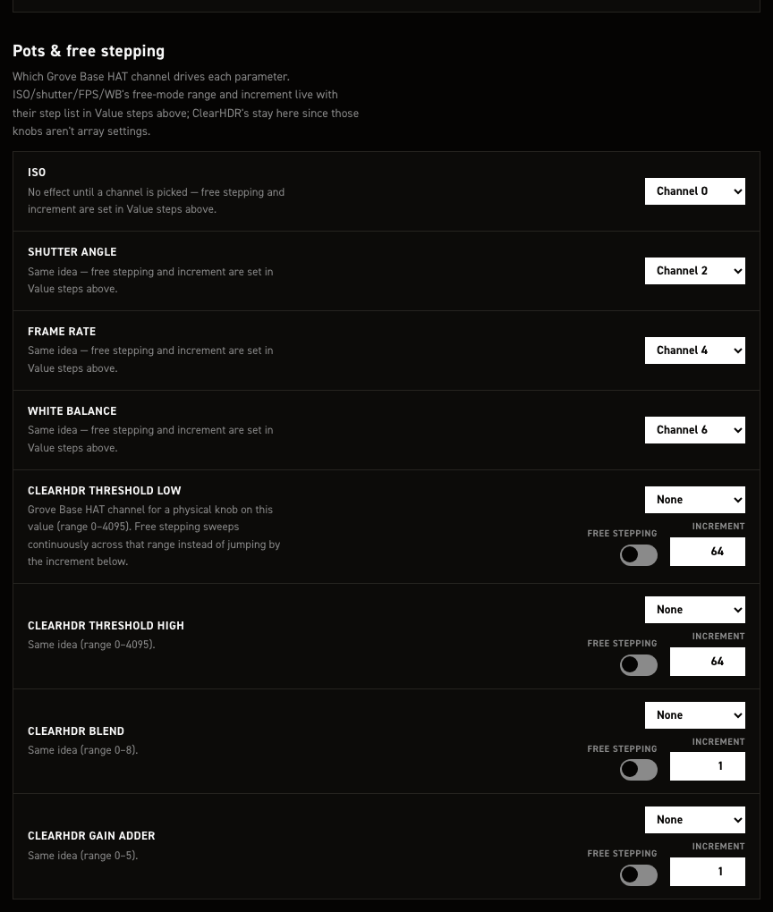

Assign a Grove Base HAT ADC channel to each parameter you want on a dial. ISO, shutter angle, frame
rate and white balance set their free stepping in **Value steps**. Only assign channels with a pot
wired: noise on an empty connector drifts the parameter on its own.

| Control | What it does |
| --- | --- |
| ISO | Grove Base HAT channel: `None`, or `Channel 0`–`Channel 7`. Opens on `Channel 0`, ships `None`. |
| Shutter angle | Same; opens on `Channel 2`, ships `None`. |
| Frame rate | Same; opens on `Channel 4`, ships `None`. |
| White balance | Same; opens on `Channel 6`, ships `None`. |
| ClearHDR threshold low | Channel; range 0–4095. Ships `None`. |
| — Free stepping | On: whole 0–4095 range by the increment. Off (default): the stops in `arrays.hdr_threshold_low.steps`. |
| — Increment | Shows `64`; ships `16`. |
| ClearHDR threshold high | Channel; range 0–4095. Ships `None`. |
| — Free stepping | Same, 0–4095. Default off. |
| — Increment | Shows `64`; ships `16`. |
| ClearHDR blend | Channel; range 0–8. Ships `None`. |
| — Free stepping | Same, 0–8. Default off. |
| — Increment | Shows `1`, which also ships. |
| ClearHDR gain adder | Channel; range 0–5. Ships `None`. |
| — Free stepping | Same, 0–5. Default off. |
| — Increment | Shows `1`, which also ships. |

!!! warning "Set the channels by hand"

    The dropdowns are display-only: they ignore `settings.jsonc`, hence the `Channel 0/2/4/6`
    openers, and saving replaces `input_peripherals.pots` with an empty list. Edit that list over
    SSH, and re-check it after every save here.

!!! warning "ClearHDR free stepping does not take effect either"

    The toggles and increments save to `image_capture.hdr.threshold_low_free`, `…_free_increment`,
    `blend_free`, `gain_adder_free`, keys CineMate never reads. It reads
    `arrays.hdr_threshold_low.free` / `free_increment` and the three matching blocks, which have no
    control here, so the toggles show off and the increments `64`/`64`/`1`/`1` whatever your file
    holds. Set them in `arrays` over SSH.

These map to `input_peripherals.pots` and (nominally) `image_capture.hdr`; the free-stepping values
CineMate reads live in [`arrays`](settings-json.md#arrays).

## Resolution & sensor

<a id="image_capture"></a>

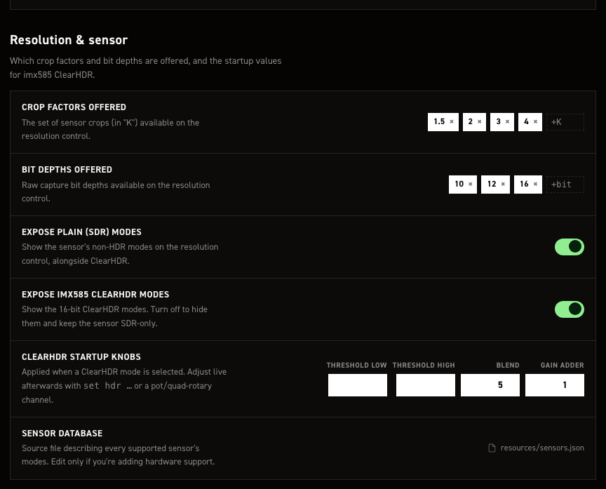

Filters which sensor modes reach the camera's resolution control, and sets the startup values for
imx585 ClearHDR.

| Control | What it does |
| --- | --- |
| Crop factors offered | Which crops appear, as "K" categories. Modes group to the nearest half-K by width, so 1332×990 is 1.5 K. Default chips `1.5`, `2`, `3`, `4`; `+K` adds one, `×` removes one. |
| Bit depths offered | Which raw depths appear. Default chips `10`, `12`, `16`; `+bit` adds one. `16` covers the imx585 16-bit ClearHDR modes. |
| Expose plain (SDR) modes | Shows the sensor's non-HDR modes alongside ClearHDR. Default on; off leaves only ClearHDR. |
| Expose imx585 ClearHDR modes | Shows them, at 12-bit and 16-bit. Default on; off keeps the sensor SDR-only. |
| ClearHDR startup knobs | The four fields below, applied whenever a ClearHDR mode is selected. |
| Threshold low | Raw level below which the sensor reads pure high-gain. Range 0–4095. Blank by default (field reads `driver`), keeping the driver's 0. |
| Threshold high | Raw level above which it reads pure low-gain. Range 0–4095. Blank by default (field reads `driver`), keeping the driver's 4095. |
| Blend | High-gain / low-gain mix in the transition zone, as a driver menu number. Range 0–8, default `5` (HG 1/16 + LG 15/16). HG-heavier is cleaner in the transition tones; LG-heavier holds highlights longer, with more grain. |
| Gain adder | Digital gain on the merge's low-gain path. Range 0–5, default `1` (+6 dB, quieter than the driver's +12 dB). Higher brightens highlights and adds grain; lower leaves them darker, to lift in the grade. |
| Sensor database | Read-only path of the file describing every sensor's modes, `resources/sensors.json` by default, shown in full for this Pi. Only relevant when adding hardware support. |

!!! warning "Set both thresholds, or neither"

    Both blank keeps the driver's own pair. Setting the two to the same value clamps every HDR frame near black. Never set just one of the pair.

!!! note "These are filters, not the mode list"

    Crop factors and bit depths only decide which database modes get shown, and both lists are global: every sensor, not per camera. Hidden modes come back the moment you add the step again, so `5.5` brings the IMX283 5K modes back.

    An empty list is not a ban. Clear every chip, or turn both mode toggles off, and that filter stops applying, so every mode is offered. If a combination leaves a camera with nothing, CineMate logs a warning and keeps that camera's full mode list.

## Per-mode fps ceilings
<a id="custom_modes"></a>

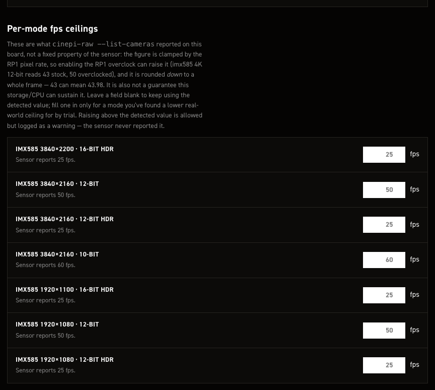

Caps the frame rate offered for one sensor mode, for when a trial recording shows that mode dropping frames.

| Control | What it does |
| --- | --- |
| Mode row label, e.g. *imx585 3856×2180 · 12-bit* | One row per mode detected at last start: sensor, resolution, bit depth, `HDR` on ClearHDR. Modes the *Resolution & sensor* whitelists exclude get none. Its "Sensor reports N fps." is the pre-override ceiling `--list-cameras` found on this board. |
| fps field | Overrides that ceiling. Blank, cleared, or the detected number means no override; the greyed value is that detected figure. Min 0, no max, decimals accepted, and the working ceiling rounds down to whole frames. |

**Save changes** restarts CineMate, which applies the ceiling; Boot config then shows
`N (capped from M)`.

!!! note "Entries for absent cameras survive"

    A `custom_modes` entry with no row here (a camera that isn't attached) is left untouched.

!!! warning "Lower, not higher"

    A ceiling above the reported figure saves but logs a warning; the sensor never claimed that rate.

!!! note "The detected figure is not fixed"

    `--list-cameras` reports it per board, clamped by the RP1 pixel rate. The overclock raises it
    (imx585 4K 12-bit: 43 stock, 50 overclocked), and it rounds down, so 43 can mean 43.98. It says
    nothing about what storage and CPU sustain; only a trial recording finds that.

No rows means no sensor modes detected. Reconnect the camera and check `cinepi-raw --list-cameras`.

These map to `image_capture.custom_modes`, listed under
[`image_capture`](settings-json.md#image_capture).

## Audio

<a id="audio_capture"></a>

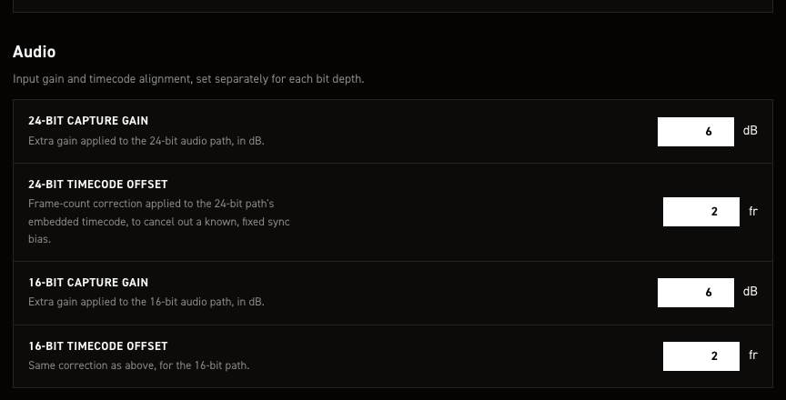

Mic input level and WAV timecode alignment. CineMate probes the USB mic: `24bit` values for 24-bit
stereo capture, `16bit` for 16-bit mono. Read at startup, so a change needs a save & restart.

| Control | What it does |
| --- | --- |
| 24-bit capture gain | In dB. `0` unity, positive boosts, negative cuts. Default `6`, step 0.5, no min/max enforced. |
| 24-bit timecode offset | Shifts the timecode in the WAV, in whole frames. Positive later, negative earlier. Default `2`. |
| 16-bit capture gain | Same, 16-bit path. Default `6`, step 0.5. |
| 16-bit timecode offset | Same, 16-bit takes. Default `2`. |

!!! note ""
    Gain goes over ALSA with `amixer` at mic detection. Mics with fixed hardware gain expose no
    writable capture control, so it never lands, only a log warning. The 16-bit value also goes to
    Redis: `cinepi-raw` re-encodes the finished WAV with it after any non-zero 16-bit take, so a
    16-bit mic that *does* take the ALSA gain is boosted twice.

!!! note ""
    An offset moves only the timecode metadata, written when the WAV is finalised; samples are never
    shifted. Use it for a fixed bias, not drift over a long take, see
    [Audio recording](audio-recording.md#timecode-offset).

These map to `audio_capture`.

## HDMI & preview

<a id="hdmi_display"></a>

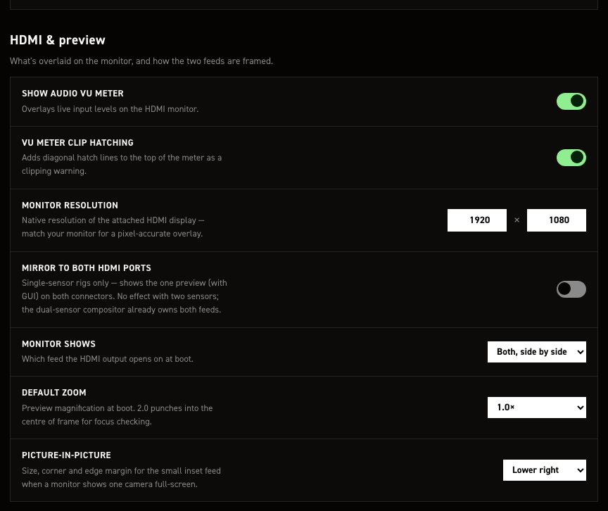

Overlays on the HDMI monitor, and how the feed is framed at boot.

| Control | What it does |
|---|---|
| **Show audio VU meter** | Mislabelled: toggles the RAM **buffer** bar, lower left. Green under 70% full, yellow under 90%, red above. Default on. The right-edge audio VU meters are separate and appear with any supported USB mic. `hdmi_display.overlays.buffer_vu_meter`. |
| **VU meter clip hatching** | Hatch lines across the buffer bar's filled part. Default on. Only visible while that bar is shown. `hdmi_display.overlays.vu_meter_hatch_lines`. |
| **Monitor resolution** | GUI canvas size; match your monitor for a pixel-accurate overlay. Default `1920` × `1080`. A smaller framebuffer wins: CineMate uses it instead of clipping the layout. |
| **Mirror to both HDMI ports** | One preview, GUI included, on both connectors. Default off. Single-sensor only; with two sensors the compositor owns both feeds. `hdmi_display.mirror_to_both_ports`. |
| **Monitor shows** | Boot feed: Camera 0, Camera 1, or Both, side by side. Default **Both, side by side**. Needs two sensors. |
| **Default zoom** | Boot magnification, 1.0× or 2.0×; 2.0× punches into frame centre for focus. Default **1.0×**. Preview only, never the recording. |
| **Picture-in-picture** | Corner for the inset when one camera is full-screen: Upper left, Upper right, Lower left, Lower right. Default **Lower right**. Needs two sensors. `hdmi_display.preview.pip.corner`, written as `upper_left`, `upper_right`, `lower_left` or `lower_right`. |

!!! note "The dropdown doesn't offer picture-in-picture"

    Enter pip on the running camera with `set preview pip_cam0` / `pip_cam1`; the corner above is
    where the inset lands. `hdmi_display.preview.default_hdmi_source` takes those as boot values too.
    See [Dual sensors](dual-sensors.md#picture-in-picture).

These map to `hdmi_display`.

## GPIO in

<a id="hardware_controls"></a>
<a id="quad_rotary_controller"></a>
<a id="combined_actions"></a>
<a id="input_peripherals"></a>

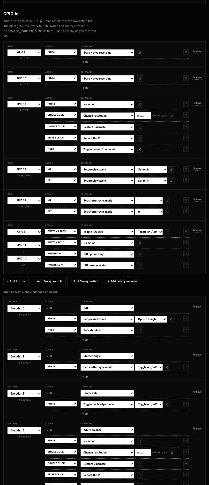

Every physical control wired to the Pi's GPIO header, plus the Adafruit quad rotary i²c board. One
row per control: its pin, then one or more gesture → command lines. A button can carry a press,
single, double and triple click, and a hold, each running a different command.

The stock image ships six controls (two record buttons, a multi-gesture button, two switches and a
rotary encoder) and the four dials of the quad rotary board. The GPIO encoder and the quad board each
carry an `enabled` flag, both `true` as shipped; set either to `false` to keep the mapping on file
while switching the device off. Creating a control, choosing its command and argument, and moving it
to another pin are covered in [Additional hardware](hardware-controls.md).

These map to `hardware_controls` and `input_peripherals`.

## GPIO out

<a id="hardware_outputs"></a>


Pins driven while recording: tally lamp, relay, or a sync tone for the scratch track. One row per
pin; the trigger is always **While rec**.

| Control | What it does |
| --- | --- |
| + Add pin | New row: REC tally, no pin. |
| Output | The row's pin, or **None** (dropped on save). Pins in use read "GPIO n — in use (…)" and are unselectable; a move asks to confirm. Ships GPIO 21 tally, GPIO 18 tone. |
| Command | **REC tally** pulls the pin high for an LED or relay; **REC tone** puts a PWM sync beep on it for a recorder input. |
| at … Hz | Tone pitch on REC tone rows; mirrors Slate tone frequency. |
| Remove | Deletes the row after a confirmation; gone from the file on save. |
| Slate tone frequency | Hertz. 1–20000, default 1000. All REC tone pins share it. |
| Slate tone duty cycle | Pulse width in percent. 1–99, default 50. |
| Mute the tone on a dropped frame | Mutes the tone for about a frame on a drop. Default off; the gap makes drops findable by ear. |

!!! tip ""
    GPIO 18 and 19 have hardware PWM and a steadier pitch; other pins fall back to software. GPIO 18
    is reserved for the slate tone, so the row shipped on it keeps it and nothing else may move
    there. Use GPIO 19 for a second tone pin.

!!! note ""
    Slate tone settings appear only with a REC tone pin. The tone follows the record command: on at
    the request, before any frame is written, off at stop, muted during storage pre-roll. Tally pins
    wait for frames on the card instead. Rows regroup on each page load, tally before tone.

These map to `hardware_outputs.rec_out_pin` and `hardware_outputs.rec_tone` (`pin`, `frequency_hz`,
`duty_cycle`, `relay_drop_frames`).

## OLED status display

<a id="output_peripherals"></a>

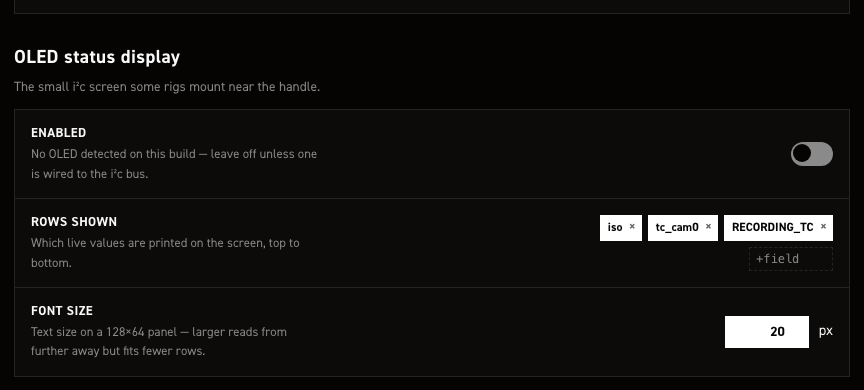

Drives the optional 128×64 i²c OLED panel.

| Control | What it does |
| --- | --- |
| Enabled | Default off. The help line always reads "No OLED detected on this build": fixed text, not a live i²c probe. |
| Rows shown | Live values printed top to bottom, as chips. Type a field name in `+field` and Enter to add, `×` to remove, drag to reorder. Default `iso`, `tc_cam0`, `RECORDING_TC`. |
| Font size | Pixels. Default `20`, no range enforced; larger reads further away but fits fewer rows on 128×64. |

!!! note ""
    Row fields are Redis keys plus a few pseudo-keys. Formatted ones: `shutter_a`→`SHUTTER °`,
    `wb_user`→`WB K`, `space_left`→`SPACE` GB, `resolution`→`1920x1080@12Bit`, `is_recording`→`●`
    while recording, `cpu_load`→`CPU`, `cpu_temp`→`TEMP`, `memory_usage`→`RAM`; `tc_cam0` and
    `RECORDING_TC` print the value only. Any other key (`iso`, `fps`, `write_speed_to_drive`) prints
    its name in capitals plus the raw value, so a typo shows as `TYPO: N/A`. `is_recording` and
    `resolution` always hoist onto the top line together, whatever the chip order.

!!! note ""
    `width` and `height` have no control here and survive no save: hand-set values are rewritten to
    128 and 64 on the next **Save changes**.

Saving restarts CineMate; the OLED is set up at startup, so changes come up on the next run.

These map to `output_peripherals.oled`, listed under
[`output_peripherals`](settings-json.md#output_peripherals).

## Restart & raw file

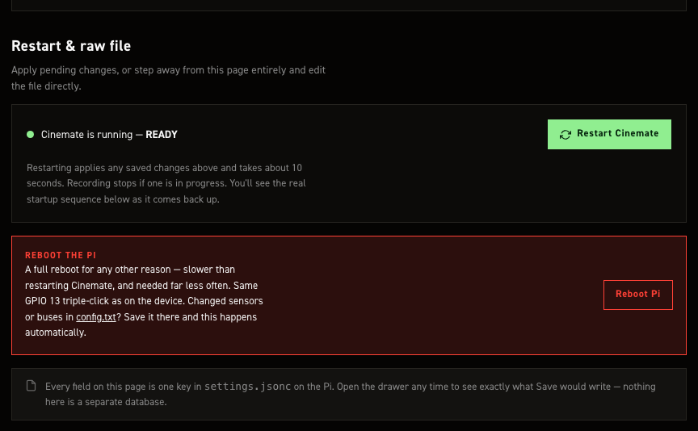

Applies changes you already saved, and reaches the raw file.

| Control | What it does |
| --- | --- |
| Cinemate is running — READY | Fixed coloured-dot label, not a live health check: always READY, except "Restarting Cinemate — please wait" during the animation. |
| Restart Cinemate | Real restart. Sends `restart cinemate` to the page API, the same dispatcher entry as the CLI and the default GPIO 13 double-click. systemd restarts `cinemate-autostart`, ~10 s per the page. Recording stops, page unresponsive until the service returns. On failure: "Restart failed" toast, nothing restarted. |
| Restart console | Opens under the button while restarting. Fixed stylised animation, same lines every time, not a live log. |
| Reboot Pi | Does not reboot. Clicks through to the **Save & reboot Pi** card on Boot config, which only plays the same animation (no `config.txt` write, no reboot) and does not switch pages, so you see only a "Pi is back up" toast. Real reboot: Save changes on Boot config, `reboot` over SSH, or GPIO 13 triple-click. |
| config.txt (link) | Inline link in the Reboot Pi text; switches to Boot config. |

!!! note "config.txt reboots itself"
    Saving on **Boot config** (sensors, buses, RP1 overclock) reboots the Pi by itself, no Reboot Pi
    button needed.

Raw-file controls sit in the top bar, on this page and Boot config only.

| Control | What it does |
| --- | --- |
| settings.jsonc | Drawer on the raw file, with a Copy button. Label follows the page (`config.txt` on Boot config), but the drawer always has both tabs. The view is the form state as plain JSON: what Save would write, minus the comments. |
| Revert | Loads the stock shipped defaults (stock `config.txt` defaults on Boot config). Nothing is written until Save changes. |
| Download | Saves the form state to your computer: `settings.jsonc`, or `config.txt` on Boot config. Same comment-free JSON as the drawer. |
| Upload | Loads a `.json`, `.jsonc` or `.txt` file into the form; parsed on the Pi, rejected if it does not parse. Nothing is written until Save changes. |

!!! warning "The drawer shows unsaved edits too"
    Drawer and Download reflect the form as it stands, unsaved edits included. The unsaved counter
    counts fields differing from what was loaded off the Pi; after a Revert or Upload it reads 1, and
    it is hidden on Boot config, where Save changes enables on any edit.

This section writes no keys of its own. It applies what the rest of the page saved into
`settings.jsonc`.

## Settings with no field on this page

<a id="https"></a>

Edit these by hand, or leave them at the defaults.

| Key | What it does |
|---|---|
| `system.web_api.*` | Wireless control API: on/off, token, rate limits, UDP status broadcast. [Web API](web-api.md#settings). |
| `system.recovery.*` | Recovery console on port 8080; whether it may edit `config.txt`. [Recovery console](recovery-console.md). |
| `system.https.enabled` | Web UI over TLS. Off by default. Self-signed cert, so a browser warning; needed for a secure context, which the RAW pane's folder download requires. |
| `system.https.cert_file` / `key_file` | Certificate pair path. Relative paths resolve from the repo root; both git-ignored, key `0600`. |
| `system.https.valid_days` | Certificate lifetime, default `3650`. Expired ones are re-issued at next start. |
| `system.storage.recognized_ssds` | Recognised SSD identifiers. Empty by default. |
| `sensors.raw_buffer_count` | Frames `cinepi-raw` buffers in RAM against write bursts. Leave at `0`; the active storage profile sets the depth. |
| `sensors.cam1.camera_name` · `override_camera_name` · `geometry.horizontal_flip` · `geometry.vertical_flip` | Camera 1 has fewer page fields than Camera 0; set these by hand for a second sensor. |
| `arrays.hdr_threshold_low` · `hdr_threshold_high` · `hdr_blend` · `hdr_gain_adder` | Click-stop tables (`steps`, `free`, `free_increment`) a pot or encoder steps through. Startup values: [Resolution & sensor](#resolution-sensor). |
| `arrays.shutter_a.sync_increment` | Granularity in shutter-angle sync mode only. Default `0.1`°, independent of the shutter angle's own free increment. |
| `image_capture.hdr.self_heal` | Auto-recovery for the flat-pedestal ClearHDR startup defect. Off by default, [details](clear-hdr.md#flat-black-pedestal-frames). |
| `hdmi_display.preview.zoom_steps` | Zoom factors `set zoom` cycles through. Default `1.0, 1.5, 2.0`; **Default zoom** offers only `1.0` and `2.0`. |
| `hdmi_display.preview.pip.scale` / `pip.margin` | PiP inset size and edge gap, as fractions of the pane. Defaults `0.28` and `0.03`. |
| `hdmi_display.preview.anamorphic.default_factor` | Desqueeze factor at startup, default `1.0`; the factor list is on the page, under **Value steps**. |
| `output_peripherals.oled.width` / `height` | OLED panel pixels. Defaults `128` × `64`. |

## Editing the file directly

On the camera:

```bash
editsettings
```

That opens `/home/pi/cinemate/settings.jsonc` in nano with syntax colouring. Without the alias:

```bash
sudo nano /home/pi/cinemate/settings.jsonc
```

The format is JSONC: JSON with `//` and `/* */` comments and trailing commas allowed. The shipped
file annotates the trickier keys in place.

Restart CineMate to apply a hand edit: type `cinemate` in an SSH session, or use **Restart CineMate**
on the page. A reboot is only for [`config.txt`](config-txt.md).

!!! note ""
    Saving from the settings editor keeps a timestamped copy of the previous file in
    `.settings-backups/` next to `settings.jsonc` (last 10). A hand edit does not, so make your own
    copy first.
