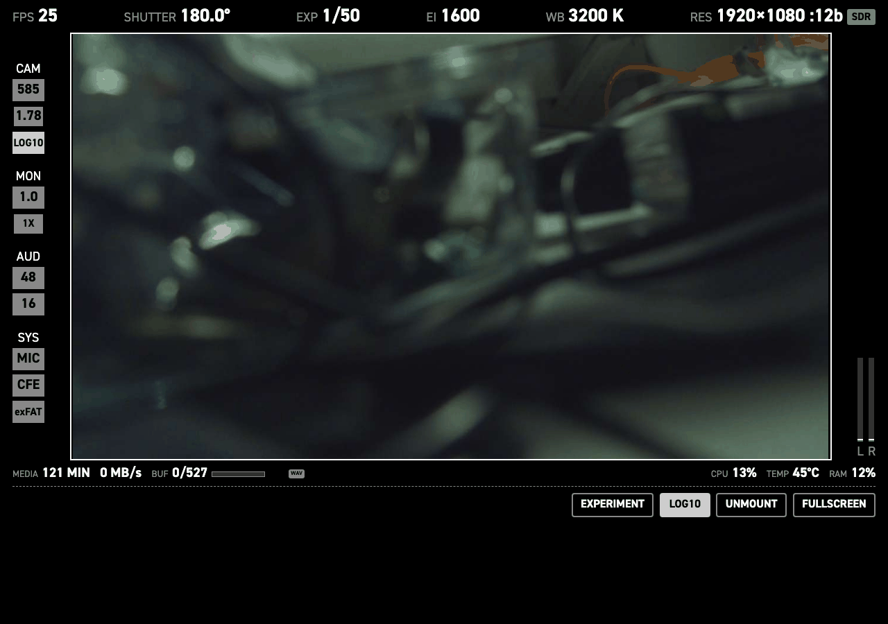
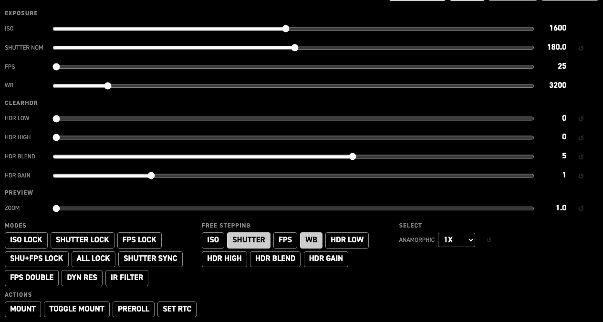

# Web GUI

CineMate serves a camera page in your browser: the live picture, most of the
[Simple GUI](simple-gui.md) readouts, and enough controls to shoot a take from a phone, tablet or
laptop.

Every control posts a CLI command line to [`/api/v1/cmd`](web-api.md), the same dispatcher the CLI
and the serial port use. Socket.IO only pushes live values back; it carries no control events.

## Open the page

| Where you are | Address |
|---|---|
| On the same network as the camera | `http://cinepi.local:5000/` |
| On the camera's own hotspot (SSID `CinePi`) | `http://10.42.0.1:5000/` |

- With [`system.https`](settings-json.md#https) enabled, use `https://`. The preview is then routed
  through a same-origin proxy at `/preview/<cam>/stream`, because a secure page may not load port
  8000 directly.
- The clean preview stream lives on port `8000` (`http://cinepi.local:8000/stream`), and on `8001`
  for a second sensor. `/stream` returns 404 until the first frame is published. A bare
  `http://cinepi.local:8000/` serves the same stream.

## Top row

Six readouts, left to right. Tap any except `EXP` to open a picker.

| Readout | Tells you | Changeable |
|---|---|---|
| `FPS` | Frame rate | Yes — posts `set fps` |
| `SHUTTER` | Actual shutter angle in degrees | Yes — posts `set shutter a` |
| `EXP` | Exposure time as a fraction, e.g. `1/50` | No — the angle over 360, divided by the frame rate |
| `EI` | ISO | Yes — posts `set iso` |
| `WB` | White balance in kelvin | Yes — posts `set wb` |
| `RES` | Recorded frame size and bit depth, e.g. `1920×1080 :12b` | Yes — posts `set resolution` |
| `SDR` / `HDR` chip | Class of the current sensor mode. Next to `RES`, and only on a sensor with both classes, such as the imx585 | No — follows the mode |

Colour in the top row:

| What you see | Means |
|---|---|
| `FPS` and `SHUTTER` values green | Shutter-angle sync is on |
| `FPS`, `SHUTTER` or `EI` drawn as a white box with black text | That parameter is locked |
| `RES` value grey | A resolution switch is in flight |
| The `FPS` or `SHUTTER` list mostly greyed out | Free stepping is on: any value between the two ends is legal, so the list is a range, not the only legal values |

## Left rail

Boxes grouped under a heading. A group only appears when it has something to show.

| Group | Box | Tells you |
|---|---|---|
| `CAM` | First box | Sensor, e.g. `585`. A monochrome sensor adds a second `MONO` box |
| `CAM` | Outlined box | Aspect ratio, e.g. `1.78` |
| `CAM` | `LOG10` / `LOG12` | [CineMate Log](cinemate-log.md) is running, at that target bit depth |
| `CAM` | `DROP` or `DROP 17` (purple) | Frames were dropped, with the count where one is published |
| `CAM` | `SYNC` (magenta, struck through) | Cameras are out of sync |
| `MON` | First box | [Digital zoom](digital-zoom.md) factor. Yellow when it is not the default |
| `MON` | Outlined box | Anamorphic factor, e.g. `1.0X` |
| `AUD` | Two boxes | Mic sample rate in kHz and bit depth, e.g. `48` and `16`. Only with a mic connected |
| `SYS` | `SER` / `MIC` / `KEY` | A USB serial device, a mic, or a keyboard is connected |
| `SYS` | Storage box | Mounted recording device: `CFE`, `SSD`, `NVME`, or `UNKNOWN` when the type cannot be identified |
| `SYS` | Filesystem box | `exFAT`, `NTFS`, or whatever the card is formatted as |

`MON` is monitoring only. Zoom and anamorphic change the preview, not the recorded frame.

## Right rail

| Item | Tells you |
|---|---|
| `L` / `R` bars | Live mic input level. Green below 60, yellow below 85, red above. The white line is the recent peak. A mic with anything other than two channels gets numbered bars |
| `CAM1` column | The second sensor, dual-sensor rigs only: sensor name, aspect ratio, exposure time, a `LOG10` / `LOG12` badge and any `DROP` / `SYNC` warning |

## Under the picture

| Readout | Tells you |
|---|---|
| `MEDIA 121 MIN` | Recording minutes left on the card at the current mode and frame rate. Shows `GB` when minutes cannot be computed, `NO DISK` when nothing is mounted |
| `0 MB/s` | Write speed to the card |
| `BUF 0/519` and its bar | Raw frames held in the RAM buffer, against the buffer's total capacity in frames |
| `0:03` | Length of the current take |
| Clip name | The last DNG written, e.g. `CINEPI_26-09-04_173520_F23_C00001_cam0_000000099` |
| `WAV` chip | Audio is being recorded, or a WAV was saved for this clip. Brightens while recording |
| `LOCK` (red) | Parameters are locked |
| `VOLTAGE` (orange) | The Pi reported undervoltage |
| `CPU` / `TEMP` / `RAM` | Pi load, SoC temperature, RAM use |
| `BATT` | Battery percentage. Only with a battery monitor attached |

## Page colour

The background is the recording state.

| Background | State |
|---|---|
| Black | Idle |
| Red | Recording — frames are being written to disk |
| Green | Buffer is pre-filling, or flushing to disk after a stop |
| Blue | [Storage preroll](storage-preroll.md) is active |
| Purple | A frame was dropped |
| Magenta flash | A sync event |

All text turns black on any non-black background.

## Set the image

Work down this list in order. Going the other way lets a later pick undo an earlier one.

1. Tap `RES` and pick a mode. First, because a mode change re-derives the frame-rate ceiling and
   re-applies your frame rate against it, so a rate set earlier can come back clamped.
2. Tap `FPS` and pick a frame rate. This rebuilds the flicker-free shutter-angle list, so it comes
   before the shutter.
3. Tap `SHUTTER` and pick an angle. `EXP` updates to the exposure time you just built.
4. Tap `EI` and pick an ISO.
5. Tap `WB` and pick a colour temperature.

A resolution change relaunches the camera when it changes the aspect ratio, the bit depth or the
SDR/HDR class. Any other mode change applies live, and nothing is relaunched mid-take. The picture
reconnects on its own and the page reloads about two seconds after the switch completes, unless a
recording is running: then it neither reloads nor interrupts the take.

If a pick does nothing and a banner says `ISO is locked`, `Shutter angle is locked` or
`Frame rate is locked`, that parameter is locked. Locks are in the EXPERIMENT drawer.

## Record a take

1. Tap anywhere on the picture. This posts `rec`.
2. The page turns red once frames are being written to disk. A brief green first means the RAM
   buffer is still pre-filling.
3. Watch `BUF` and `MEDIA` while you roll. The timer under the picture counts the take.
4. Tap the picture again to stop.
5. The page turns green while the buffer flushes, then black. The take is on the card when it is
   black again.

Tapping the picture while `CAMERA NOT FOUND` is showing does nothing.

## Before you pull the drive

1. Stop recording and wait for the background to go black.
2. Press `UNMOUNT`.
3. Wait for `MEDIA` to read `NO DISK`.
4. Pull the drive.

## The button row

| Button | What it does |
|---|---|
| `EXPERIMENT` | Opens and closes the EXPERIMENT drawer. Highlighted while it is open |
| `LOG` | Posts `set log`, toggling [CineMate Log](cinemate-log.md). The label becomes the live badge, `LOG10` or `LOG12`, and highlights while log encoding is running. Restarts the camera when idle; pressed mid-take, it applies at the next restart |
| `UNMOUNT` | Posts `unmount`, unmounting the recording drive |
| `FULLSCREEN` | Puts the page fullscreen; the label then reads `EXIT FULLSCREEN`. Absent on browsers with no fullscreen API, such as Safari on iPhone |

## Automatic behaviour

- A rejected command appears as a short banner at the bottom of the screen, with the reason. A
  command accepted but not stuck reports that too, e.g. `requested 8, live value is 4`.
- The preview reconnects by itself after a camera restart, a settings save or a crash, retrying
  until frames flow again.
- The preview border turns yellow when digital zoom is not at its default.
- With no camera detected, the picture area shows `CAMERA NOT FOUND` with a cable hint and a warning
  to disconnect power before connecting or disconnecting a sensor board.
- The layout scales, it never restacks. Left rail, picture and right rail hold their places at any
  width or orientation; the rails and top-row text shrink instead. The clip name and the `WAV` badge
  have pixel floors (10px/8px).

!!! note ""

    With dual sensors, cam1's preview is served on port `8001` and shown side by side with cam0,
    with its own status column and clip name line. The control UI stays on port `5000`.

Most HDMI GUI fields reach this page, but not all. The recording-integrity counts (frame count,
frames-in-sync, missing-frame count, drop-frame flags) and a few host/label fields are HDMI-only;
run `tools/gui_field_extract.py` for the exact current list.

Not every control path goes through `/api/v1/cmd`. GPIO, the analog pots, the quad rotary encoder,
storage preroll and the on-camera HDMI GUI call the controller directly. The pots serialise against
the dispatcher through a shared lock, so a moving pot cannot out-write an explicit `set`; the other
paths do not, so a GPIO press can still race a web command.

The picture here is the live camera. To watch back a take, see [Playback](playback.md), which plays
the recorded CinemaDNG from the card at the conform frame rate.

## The EXPERIMENT drawer

`EXPERIMENT` is the first button in the row below the picture. It opens a drawer of live widgets for
the controls the layout above does not show: the locks, free stepping, the ClearHDR knobs, zoom,
anamorphic, the mount actions. Move a control and watch the preview; nothing has to be wired, mapped
or written to a settings file first. That is where a build gets designed: find the value or mode you
want on the running camera, then commit it as a startup default in the
[settings editor](settings-editor.md), or onto a knob, pot or switch in
[Additional hardware](hardware-controls.md).

Not in the drawer: the `inc`/`dec` pairs, `set thumbnail`, `restart camera`, `restart cinemate` and
the four destructive commands. `rec`, `set shutter a`, `set resolution`, `set log` and `unmount` are
on the page already.

The preview scales down to make room and the bottom rows ride up; nothing else moves. The drawer
scrolls inside its own height cap — 46% of the viewport height, at most 460px, and 40% on a narrow
or portrait screen — and lays its groups out in as many ~340px columns as fit, so one column on a
phone. Rows below the fold fade out.

| Group | Controls | What it is for |
|---|---|---|
| `EXPOSURE` | `ISO`, `SHUTTER NOM`, `FPS`, `WB` — four sliders | The exposure parameters as full-width tracks instead of steppers. `SHUTTER NOM` is the nominal angle (`set shutter a nom`), not the top row's `set shutter a`. |
| `CLEARHDR` | `HDR LOW`, `HDR HIGH`, `HDR BLEND`, `HDR GAIN` — four sliders | **Only on a sensor with ClearHDR modes.** The raw level below which the sensor reads pure HG and the one above which it reads pure LG (0–4095 each), the HG:LG mix inside the transition zone (0–8), and the digital gain on the low-gain path (0–5). They only do something while a ClearHDR mode is selected. See [ClearHDR](clear-hdr.md). |
| `PREVIEW` | `ZOOM` — one slider | Digital preview zoom across the whole configured span — the ends of `hdmi_display.preview.zoom_steps` in 0.1 steps, `1.0`–`2.0` as shipped — not just the cycle-able stops. Monitoring only. See [Digital zoom](digital-zoom.md). |
| `MODES` | `ISO LOCK`, `SHUTTER LOCK`, `FPS LOCK`, `SHU+FPS LOCK`, `ALL LOCK`, `SHUTTER SYNC`, `FPS DOUBLE`, `DYN RES`, `IR FILTER` — nine toggles | The camera's mode flags. Each lights while its parameter is on, so the row doubles as a state readout. |
| `FREE STEPPING` | `ISO`, `SHUTTER`, `FPS`, `WB`, `HDR LOW`, `HDR HIGH`, `HDR BLEND`, `HDR GAIN` — eight toggles | Swaps a parameter's step table in `settings.jsonc` for continuous stepping in units of its `free_increment`. Changes `inc`/`dec` granularity, not the value. `SHUTTER` and `WB` ship on (`arrays.shutter_a.free`, `arrays.wb.free`), so those two start lit. |
| `SELECT` | `ANAMORPHIC`, `HDMI PREVIEW` — two dropdowns | Anamorphic desqueeze (the factors configured in `settings.jsonc`; `1X` / `1.33X` / `2X` as shipped), and the HDMI preview source on a dual-sensor rig: `BOTH` (side by side), `CAM0`, `CAM1`, `PIP_CAM0`, `PIP_CAM1`. |
| `ACTIONS` | `MOUNT`, `TOGGLE MOUNT`, `PREROLL`, `SET RTC` — four buttons | One-shot commands with no state: mount storage, mount-or-unmount, run the [storage pre-roll](storage-preroll.md) warm-up clip, copy system time to the RTC. |

ISO, shutter angle, FPS and white balance are also in the top row as steppers; the sliders send the
same commands. A slider is one of two kinds, decided by what its command does with an arbitrary
value:

| Kind | Controls | Behaviour |
|---|---|---|
| Continuous | ISO, zoom | The command clamps to a range, so any position on the track is reachable |
| Step table | Shutter angle, FPS, WB | The command snaps to a table, so the slider offers exactly that table's values and nothing else |

The step tables are live. Change the frame rate and the shutter slider re-grids to the new
flicker-free angles; change sensor mode and the FPS slider re-grids to the new ceiling; toggle a
free-stepping button and the affected slider swaps its preset table for a continuous grid.

Every widget carries its command as a tooltip and posts to [`/api/v1/cmd`](web-api.md) like the rest
of the page, so a control tried here behaves exactly as it will from the [CLI](cli-commands.md).

| Widget | Command |
|---|---|
| `ISO` / `SHUTTER NOM` / `FPS` / `WB` | `set iso` · `set shutter a nom` · `set fps` · `set wb` |
| `HDR LOW` / `HDR HIGH` / `HDR BLEND` / `HDR GAIN` | `set hdr threshold low` · `set hdr threshold high` · `set hdr blend` · `set hdr gain adder` |
| `ZOOM` | `set zoom` |
| `ISO LOCK` / `SHUTTER LOCK` / `FPS LOCK` | `set iso lock` · `set shutter a nom lock` · `set fps lock` |
| `SHU+FPS LOCK` / `ALL LOCK` | `set shutter a nom fps lock` · `set all lock` |
| `SHUTTER SYNC` / `FPS DOUBLE` / `DYN RES` | `set shutter a sync` · `set fps double` · `set dynamic resolution` |
| `IR FILTER` | `set filter` |
| `FREE STEPPING` toggles | `set iso free` · `set shutter a free` · `set fps free` · `set wb free` · `set hdr threshold low free` · `set hdr threshold high free` · `set hdr blend free` · `set hdr gain adder free` |
| `ANAMORPHIC` / `HDMI PREVIEW` | `set anamorphic factor <n>` · `set preview both\|cam0\|cam1\|pip_cam0\|pip_cam1` |
| `MOUNT` / `TOGGLE MOUNT` / `PREROLL` / `SET RTC` | `mount` · `toggle mount` · `storage preroll` · `set rtc time` |

Two details the tooltips do not show:

- Most toggles send the bare command and let the setter invert the flag. `SHU+FPS LOCK` and
  `IR FILTER` send an explicit `1` or `0`, because neither setter has a usable no-argument path.
- A drag is coalesced to one command per 150 ms (600 ms for `FPS`), and the value the gesture ended
  on is always sent. The API's own ceiling is 20 commands per second per client.

### What appears, and when

- The `CLEARHDR` sliders, and the four HDR toggles in `FREE STEPPING`, appear only on a sensor whose
  mode table contains at least one ClearHDR mode. On an imx477 or imx283 those commands would write
  Redis keys nothing reads, so the controls are not offered.
- `HDMI PREVIEW` appears only when a second sensor is attached. See [Dual sensors](dual-sensors.md).
- `IR FILTER` is always shown, but only moves on an imx585. Any other sensor returns early.
- A slider greys out and stops accepting input when its parameter is locked (`ALL LOCK` counts — it
  sets the three individual locks), when its step table has not arrived yet, or — for `FPS` — while
  a resolution switch is in flight. The row's tooltip says which.

### The reset arrow

A `↺` sits to the right of a slider's value, and beside the `ANAMORPHIC` dropdown.

- It sends that control's startup value, the one the camera seeds at boot from `settings.jsonc`:
  `image_capture.hdr.*` for the four HDR knobs, `hdmi_display.preview.default_zoom` for zoom,
  `hdmi_display.preview.anamorphic.default_factor` for anamorphic, and 180° for nominal shutter
  angle, which has no settings key.
- It greys out while the row already shows that value, and while the row is disabled.
- Only those six parameters have a configured default. `ISO`, `FPS` and `WB` have none, so their
  arrows are hidden; the space is kept so the value column stays aligned. The `ANAMORPHIC` arrow is
  the exception: with no default it greys out rather than disappearing, and says so.
- `threshold_low` and `threshold_high` ship as `null`, meaning "leave the sensor driver's own pair
  alone". Those two arrows then read `Reset to 0` and stay greyed while the sliders read `0` — that
  is a value, not "no change". Set both thresholds, or neither.

### Live, not saved

Everything in this drawer is runtime state. It applies to the running camera at once and it is
**not** written back to `settings.jsonc`.

| On the next start | What happens |
|---|---|
| Zoom, anamorphic factor, HDMI preview source, the four ClearHDR knobs | Re-seeded from `settings.jsonc`, so your live value is gone |
| The locks, `SHUTTER SYNC`, `FPS DOUBLE`, nominal shutter angle | Back to off / 180° — code defaults, held in the controller |
| Free stepping | Back to `arrays.<parameter>.free` in `settings.jsonc` |
| `FPS` and `DYN RES` | Restored from Redis. These two do survive a restart |

To keep a value, commit it somewhere that persists:

| To make it… | Go to |
|---|---|
| the value the camera starts at | [Settings editor](settings-editor.md) |
| a knob, pot, switch or encoder on the camera | [Additional hardware](hardware-controls.md) |

Sliders show the live value, so one moves when a pot, the quad rotary encoder, serial or the CLI
changes the same parameter. A slider you have just moved holds where you put it until the camera
reports the same value back. If the value never comes back the write did not stick, and the slider
returns to the true value after about four seconds; the reason appears as a banner at the bottom of
the page (`requested 8, live value is 4`).

### Cautions

- Every widget writes to the camera the moment it is touched. These are live controls, not a
  sandbox: do not go browsing in here mid-take.
- `ANAMORPHIC` restarts cinepi-raw, the one control in the drawer that does; everything else applies
  without a relaunch. It stretches the preview only, never the recorded frame: this page re-shapes
  at once, while the on-camera HDMI preview window is sized from a launch argument, so it takes the
  new shape at the next camera launch.
- `FPS` can trigger a sensor-mode change — a live reconfigure, not a relaunch — and that setter
  paces itself, so the request can block for seconds. The row disables itself while the switch is in
  flight.
- `PREROLL` records a two-second warm-up clip at the mode's maximum FPS, then deletes it and
  restores your frame rate. The page turns blue while it runs. It does nothing if no media is
  mounted or a take is already rolling.
- `erase`, `format`, `reboot` and `shutdown` are deliberately absent. They are the four commands the
  web API blocks unless `allow_destructive` is set. Use the [CLI](cli-commands.md) for those.
